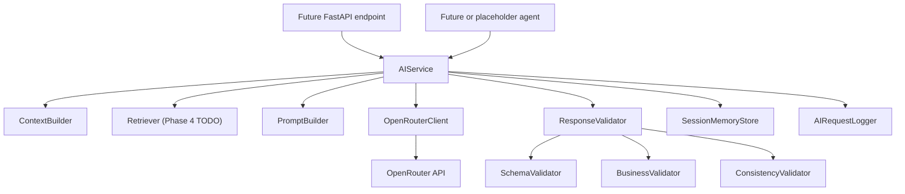

# UrjaNetra AI - AI Infrastructure Architecture

This phase adds a reusable AI infrastructure layer without changing existing
frontend pages, routers, or deterministic engines.

## Goals

- Centralize all future AI calls behind `AIService`.
- Keep OpenRouter details inside `OpenRouterClient`.
- Keep deterministic business engines unchanged.
- Normalize backend outputs before prompt creation.
- Validate AI responses before they reach future endpoints.
- Prepare RAG and memory interfaces without implementing RAG logic yet.

## Runtime Flow



## Boundaries

`AIService` is the only orchestration entry point. Future endpoints should call
methods such as `generate_explanation`, `generate_report`, `run_red_team`,
`run_copilot`, or `generate_spr_analysis`.

`OpenRouterClient` is the only provider-specific class. It loads `.env`
configuration, selects models by role, manages the pooled HTTP client, retries
requests, handles timeouts, supports streaming, parses JSON responses, and logs
sanitized provider metadata.

`ContextBuilder` accepts structured outputs from the existing engines and
returns normalized JSON. It does not create prompts and does not call models.

`PromptBuilder` assembles system prompt, context JSON, retrieved knowledge,
user query, and output schema. It does not know model names or provider APIs.

`ResponseValidator` runs schema, business, and consistency validation in order.
Validation failures are returned as structured results and do not crash the
backend.

## Configuration

The AI provider configuration is read from `.env` by `OpenRouterClient` through
`AIConfig`. Required values:

```text
OPENROUTER_BASE_URL=
OPENROUTER_API_KEY=
OPENROUTER_MODEL_COPILOT=
OPENROUTER_MODEL_EXPLAIN=
OPENROUTER_MODEL_REDTEAM=
OPENROUTER_MODEL_REPORT=
OPENROUTER_MODEL_SPR=
OPENROUTER_TIMEOUT=
OPENROUTER_MAX_RETRIES=
OPENROUTER_TEMPERATURE=
OPENROUTER_TOP_P=
```

No API key or model name is hardcoded in source code.

## Current Phase Limits

- No existing API endpoint has been changed.
- No frontend page has been changed.
- No deterministic engine has been changed.
- RAG embeddings and retrieval are interface-only placeholders.
- AI agent classes are facades that delegate to `AIService`.
