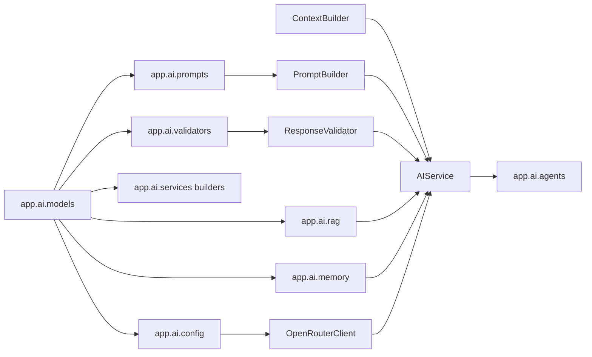
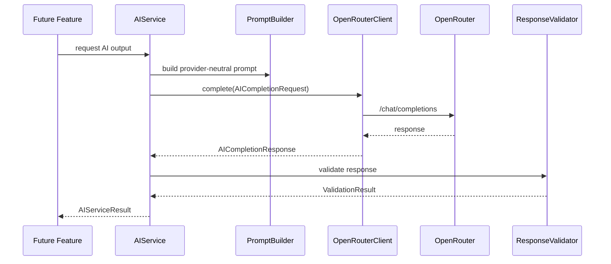

# UrjaNetra AI - AI Dependency Diagram

## Package Dependencies

## Dependency Rules

- Agents depend on `AIService`, never on `OpenRouterClient`.
- Future endpoints should depend on `AIService`, never on `OpenRouterClient`.
- `OpenRouterClient` depends on configuration and HTTP transport only.
- Builders and validators depend on shared AI models, not on provider clients.
- RAG components are placeholders and do not call external embedding services.
- The existing `app.core` engines remain independent of the AI package.

## Provider Boundary

