# Aegis / UrjaNetra AI
## Agentic Energy Crisis Decision & Response Platform
### Master Technical, Architecture, Algorithm, Feature & Demo Documentation

---

## 1. Executive Summary & Project Identity

### 1.1 What is Aegis / UrjaNetra?
**Aegis** (integrated into the **UrjaNetra AI** platform) is a sovereign, bounded autonomous decision-support prototype engineered to defend India's national energy supply chain against maritime chokepoint blockades, geopolitical conflicts, physical trade disruptions, and price shocks.

Unlike traditional static dashboards that merely visualize historical telemetry, and unlike chatbots that hallucinate numbers and offer superficial textual advice, Aegis functions as a **verifiable, tool-calling agentic orchestrator**. It couples high-level artificial intelligence (for mission intent comprehension and strategic goal formulation) with **deterministic, mathematically grounded computation engines** (for composite risk calculation, linear multi-objective procurement optimization, subterranean strategic petroleum reserve drawdown kinetics, sanctions screening, and macroeconomic impact pass-through).

Aegis is governed by an adversarial **Red Team replanning feedback loop**, a server-side **Sovereign Policy Gate**, a cryptographic **SHA-256 tamper-evident audit chain**, and **bounded human-in-the-loop authorization** enforcing strict statutory clearance controls (`LEVEL-5 COSMIC TOP SECRET`).

### 1.2 The Core Problem
India is the world's third-largest crude oil consumer, importing approximately **87% to 88% of its total domestic crude requirements** (~4.5M to 5.0M barrels per day). Over **40% to 45% of these seaborne imports must transit through a single maritime chokepoint: the Strait of Hormuz** (between Oman and Iran). 

When a geopolitical shock occurs (e.g., naval mine warfare, drone strikes, tanker seizures, or armed blockades in the Strait of Hormuz, Bab-el-Mandeb, or the Malacca Strait):
1. **Physical Logistics Stall**: 14 to 30 days of maritime transit delays emerge immediately as VLCC (Very Large Crude Carrier) tankers are forced to reroute thousands of nautical miles around the Cape of Good Hope.
2. **Insurance Premiums Explode**: P&I (Protection and Indemnity) clubs trigger war-risk clauses, multiplying hull and cargo insurance rates by 250% to 400%.
3. **Crude Prices Spike**: Global benchmarks (Brent) jump by $15 to $35/barrel within hours.
4. **Current Account Deficit (CAD) & Inflation Stress**: Every $10/barrel rise in crude widens India's annual import bill by approximately $14B to $16B USD, pushing up wholesale and consumer price inflation (CPI) and draining foreign exchange reserves.
5. **Reserve Depletion Hazard**: India's national underground **Strategic Petroleum Reserves (SPR)** managed by ISPRL (located in salt and rock caverns at Visakhapatnam, Mangaluru, and Padur) hold ~23.6M barrels of usable physical stock across 39.0M barrels total capacity. If released improperly, sovereign reserves are depleted within days, leaving the nation defenseless against prolonged warfare.

### 1.3 Why Ordinary Approaches Fail
- **Static Dashboards**: Display numbers after the fact. When a crisis breaks out, human analysts in the Ministry of Petroleum & Natural Gas (MoP&NG) and state-owned refiners (IOCL, BPCL, HPCL) spend 36 to 72 hours manually assembling spreadsheets across shipping databases, refinery slates, spot price tickers, and sanctions registries.
- **Generic LLMs & Chatbots ("Architecture Theatre")**: Large language models cannot perform domain mathematics. When asked to plan an emergency response, a raw LLM hallucinates freight rates, invents crude prices, overlooks sulfur compatibility with domestic refineries, violates OFAC SDN sanctions, and suggests illegal or physically impossible cavern drawdown rates.
- **Unbounded Autonomous Agents**: Autonomous systems that directly execute real-world purchasing or discharge sovereign reserves without human oversight represent an unacceptable national security risk.

### 1.4 The Aegis Approach: Bounded Agentic Autonomy
Aegis bridges this gap through a strict separation of concerns:
$$\text{Strategic Mission} \longrightarrow \text{AI Intent Parser} \longrightarrow \text{Deterministic Domain Engines} \longrightarrow \text{Plan V1} \longrightarrow \text{Adversarial Red Team}$$
$$\longrightarrow \text{Constraint Revision} \longrightarrow \text{Plan V2} \longrightarrow \text{Policy Gate} \longrightarrow \text{Human Approval (LEVEL-5)} \longrightarrow \text{Execution & Audit}$$

1. **AI Reasoner, Never Calculator**: The LLM translates natural language mission directives into structured optimization weights and strategic parameters. It is mathematically forbidden from generating domain figures.
2. **Deterministic Source of Truth**: 100% of risk scores, import shortfall volumes, landed purchase costs, transit ETAs, cavern discharge curves, and macroeconomic figures are generated by audited Python calculation engines.
3. **Adversarial Red Team Replanning**: Initial plans (Plan V1) are aggressively audited by a Red Team module that checks for single points of failure and chokepoint exposures. If rejected, structured constraints are passed back to re-run the optimizers, producing an improved **Plan V2**.
4. **Server-Side Sovereign Policy Gate**: Validates statutory boundaries (e.g., 20% critical SPR floor, sanctions registries, landed cost limits).
5. **Human-in-the-Loop Clearance Gate**: High-risk actions (such as SPR drawdowns > 5M bbl) halt in state `AWAITING_APPROVAL`. Only operators holding authenticated `LEVEL-5 COSMIC TOP SECRET` clearance can authorize execution.
6. **Cryptographic Provenance**: Every executed decision is anchored into a tamper-evident SHA-256 chained audit log.

---

## 2. 30-Second Explanation (Spoken Pitch)

> "Aegis is an agentic energy resilience platform designed to defend India's crude oil supply chain during maritime blockades and geopolitical crises. 
>
> When a crisis occurs, an operator gives Aegis a high-level strategic mission—for instance, 'stabilize refinery supply while minimizing SPR depletion.' 
>
> Aegis uses an LLM to interpret that mission into mathematical optimization weights, then calls a strict registry of validated tools backed by deterministic domain engines to calculate the exact supply gap, evaluate global alternative suppliers, and model cavern drawdown physics. 
>
> It synthesizes an initial Plan V1, but rather than blindly trusting it, an automated adversarial Red Team stress-tests the plan, rejects vulnerabilities like single-route dependence, and forces a re-optimization into Plan V2. 
>
> Before anything can execute, a server-side Sovereign Policy Gate enforces statutory safety floors, pausing high-risk releases until an authorized commander with Level-5 clearance reviews and signs off. 
>
> Once approved, the decision executes, generating a cryptographically chained, tamper-evident audit record."

---

## 3. Beginner Explanation: Core Concepts & Analogies

To understand Aegis without prior background in artificial intelligence or energy logistics, consider the following analogies:

| Technical Concept | Simple Analogy | What It Actually Does in Aegis |
| :--- | :--- | :--- |
| **Large Language Model (LLM)** | **The Chief of Staff / Strategist** | Reads natural language instructions from the commander, understands intent, and determines priorities (e.g., speed vs. cost vs. risk). It does **not** do the math. |
| **Deterministic Engines** | **The Engineering Corps / Certified Calculators** | Dedicated Python calculation modules that compute physical reality: tanker travel times, barrel deficits, cavern drawdown speeds, and crude pricing equations. They give the exact same answer every time for identical inputs. |
| **Tool Registry** | **The Authorized Toolchest** | A strictly defined menu of 15 tools with input parameter checking. The AI cannot run arbitrary code; it can only request specific calculations from this controlled menu. |
| **Agent Orchestrator** | **The Mission Coordinator** | A state machine that manages the step-by-step workflow: receives the goal, invokes tools, gathers outputs, synthesizes candidate plans, and logs progress. |
| **Adversarial Red Team** | **The Devil's Advocate / Inspector General** | A dedicated engine whose only job is to poke holes in the first proposal (Plan V1). It checks if the plan relies on an unsafe route or puts too many eggs in one basket. |
| **Replanning** | **The Strategy Revision** | When the Red Team rejects Plan V1, the orchestrator updates its constraints (e.g., "strictly avoid the Persian Gulf") and re-runs the calculations to generate Plan V2. |
| **Policy Gate** | **The Security Checkpoint / Statutory Guardrail** | A hard-coded rulebook running on the server. If an action breaches statutory law (e.g., draining emergency caverns below the 20% national emergency floor), it halts the system immediately. |
| **Human-in-the-Loop** | **The Commander's Nuclear Launch Key** | The AI never has the authority to release emergency sovereign oil reserves or spend billions on its own. For high-risk decisions, the platform pauses and demands human sign-off. |
| **Audit Chain** | **The Tamper-Evident Black Box** | A digital ledger where every single event contains a cryptographic fingerprint (SHA-256 hash) of the event before it. If someone modifies a historical record in the database, the chain breaks instantly. |
| **Safe Mode** | **The Emergency Mechanical Backup** | If the internet goes down or the AI provider fails, Aegis automatically switches to pre-programmed deterministic decision logic so the command room never goes dark. |

---

## 4. Complete System Architecture

### 4.1 High-Level Component Architecture

```mermaid
flowchart TD
    subgraph CLIENT["Client Layer (React 18 + Vite)"]
        UI_CC["Command Center UI (/command-center)"]
        UI_AP["Aegis Agent Panel (AegisAgentPanel.jsx)"]
        UI_RT["Red Team Diff Inspector (Plan V1 vs V2)"]
        UI_PG["Policy Gate & Clearance Banner"]
        UI_AUD["Audit & Decision Lineage Card"]
    end

    subgraph API_GW["FastAPI Application Gateway (/api)"]
        R_AUTH["Auth Router (/api/auth) - JWT, RBAC & MFA"]
        R_AGENT["Agent Router (/api/agent) - Run, Approve, Reject, Replan"]
        R_PIPE["Scenario & Pipeline Router (/api/pipeline)"]
        R_COPILOT["JARVIS Copilot Router (/api/ai/copilot)"]
        R_AUDIT["Audit Verification Endpoint (/api/agent/audit/verify)"]
    end

    subgraph ORCHESTRATOR["Aegis Autonomous Orchestration Engine (orchestrator.py)"]
        ORCH_STATE["Persistent State Machine (AgentRun / AgentStep)"]
        ORCH_INTENT["Mission Intent Analyzer (OpenRouter LLM / Safe Mode)"]
        ORCH_SYNTH["Deterministic Plan Synthesizer"]
        ORCH_REDTEAM["Adversarial Feedback Controller"]
        ORCH_REPLAN["Constraint Revision Engine"]
        ORCH_EXEC["Final Decision Executor"]
    end

    subgraph TOOLS["Central Tool Registry (registry.py - 15 Schema-Validated Tools)"]
        T_SCEN["get_scenario_context"]
        T_RISK["get_risk_assessment"]
        T_GAP["get_supply_gap"]
        T_ECON["calculate_economic_impact"]
        T_PROC["optimize_procurement"]
        T_SPR["create_spr_plan"]
        T_COMP["validate_compliance"]
        T_RT["run_red_team"]
        T_DEC["create_decision"]
        T_AUD["write_audit_event"]
    end

    subgraph ENGINES["Deterministic Mathematical Engines (Single Source of Truth)"]
        E_RISK["Risk Engine (risk_engine.py) - 7-Vector Weighted Sum"]
        E_PROC["Procurement Engine (procurement_engine.py) - Multi-Attribute Utility"]
        E_SPR["SPR Cavern Engine (spr_engine.py) - Subterranean Discharge Kinetics"]
        E_COMP["Compliance Shield (compliance_engine.py) - OFAC/UN/G7 Price Cap"]
        E_ECON["Economic Engine (economic_engine.py) - Macro Pass-Through"]
        E_SCEN["Scenario Engine (scenario_engine.py) - 15 Grounded Reference Sets"]
        E_RT["Red Team Validator (redteam_engine.py) - Vulnerability Auditor"]
        E_GATE["Sovereign Policy Gate (policy_gate.py) - Statutory Guardrails"]
    end

    subgraph PERSISTENCE["Cryptographic & Relational Persistence (SQLite: urjanetra.db)"]
        DB_RUN["agent_runs (Mission state, plans, policy verdict, audit id)"]
        DB_STEP["agent_steps (Fine-grained step trace, tool latency, I/O)"]
        DB_DEC["decisions (Immutable sovereign directives)"]
        DB_AUD["audit_logs (SHA-256 Chained Cryptographic Ledger)"]
        DB_USERS["users & user_auth (Clearance levels & credentials)"]
    end

    UI_AP -->|1. Submit Mission| R_AGENT
    R_AGENT -->|2. Instantiate Run| ORCH_STATE
    ORCH_STATE -->|3. Analyze Mission Intent| ORCH_INTENT
    ORCH_INTENT -->|4. Tool Invocation| TOOLS
    TOOLS -->|5. Compute Exact Physics & Math| ENGINES
    ENGINES -->|6. Return Verified Domain Figures| TOOLS
    TOOLS -->|7. Step Observations| ORCH_SYNTH
    ORCH_SYNTH -->|8. Generate Plan V1| ORCH_REDTEAM
    ORCH_REDTEAM -->|9. Tool: run_red_team| T_RT
    T_RT -->|10. Evaluate Weak Assumptions| E_RT
    E_RT -->|11. REJECT Plan V1 + Objections| ORCH_REPLAN
    ORCH_REPLAN -->|12. Revised Constraints| TOOLS
    TOOLS -->|13. Re-run Optimizers| ENGINES
    ORCH_SYNTH -->|14. Generate Plan V2| E_GATE
    E_GATE -->|15. Check Statutory Floors| ORCH_STATE
    ORCH_STATE -->|16. AWAITING_APPROVAL| UI_PG
    UI_PG -->|17. Commander Authorization| R_AGENT
    R_AGENT -->|18. Verify Clearance| E_GATE
    E_GATE -->|19. Authorize Execution| ORCH_EXEC
    ORCH_EXEC -->|20. Record Decision| DB_DEC
    ORCH_EXEC -->|21. SHA-256 Chained Log| DB_AUD
    DB_AUD -->|22. Verify Integrity| R_AUDIT
```



### 4.2 Data Flow Architecture

```mermaid
sequenceDiagram
    autonumber
    actor User as Operator / Commander
    participant Panel as AegisAgentPanel.jsx
    participant Router as /api/agent Router
    participant Orch as AegisAgentOrchestrator
    participant Tools as ToolRegistry
    participant Engines as Deterministic Engines
    participant Gate as PolicyGate
    participant DB as SQLite / AuditChain

    User->>Panel: Selects Scenario & Enters Strategic Mission
    Panel->>Router: POST /agent/run {scenario_id, mission, user_id}
    Router->>Orch: run_mission()
    Orch->>DB: INSERT INTO agent_runs (status='RUNNING', iteration=1)
    
    rect rgb(240, 248, 255)
    Note over Orch,Tools: Phase: Strategic Intent & Priority Derivation
    Orch->>Orch: _analyze_mission_intent() -> OpenRouter LLM (or Safe Mode)
    Orch->>DB: INSERT INTO agent_steps (action='LLM_INTENT_ANALYSIS')
    end

    rect rgb(255, 250, 240)
    Note over Orch,Engines: Phase: Deterministic Domain Computations
    Orch->>Tools: execute("get_scenario_context")
    Tools->>Engines: scenario_engine.get_scenario()
    Orch->>Tools: execute("get_risk_assessment")
    Tools->>Engines: risk_engine.calculate_risk() -> 87/100
    Orch->>Tools: execute("get_supply_gap")
    Tools->>Engines: scenario_engine.calculate_gap() -> 2.4M bbl/day
    Orch->>Tools: execute("optimize_procurement", weights)
    Tools->>Engines: procurement_engine.optimize() -> UAE Murban, Saudi Arab Light
    Orch->>Tools: execute("create_spr_plan", gap, eta)
    Tools->>Engines: spr_engine.plan_spr() -> 38.4M bbl requested
    Orch->>Tools: execute("validate_compliance")
    Tools->>Engines: compliance_engine.evaluate() -> OFAC/G7 Check
    end

    rect rgb(255, 240, 245)
    Note over Orch,Engines: Phase: Adversarial Red Team Replanning Loop
    Orch->>Orch: _synthesize_plan("V1")
    Orch->>Tools: execute("run_red_team", plan_v1)
    Tools->>Engines: redteam_engine.validate() -> REJECTED (Chokepoint transit & excessive SPR)
    Orch->>DB: INSERT INTO agent_steps (action='REPLAN', iteration=2)
    Orch->>Tools: re-execute("optimize_procurement", exclude_routes=['Strait of Hormuz'])
    Tools->>Engines: procurement_engine.optimize() -> West Africa, Brazil Tupi
    Orch->>Tools: re-execute("create_spr_plan", spr_cap=12.0)
    Tools->>Engines: spr_engine.plan_spr() -> 12.0M bbl allocated
    Orch->>Orch: _synthesize_plan("V2")
    end

    rect rgb(245, 255, 245)
    Note over Orch,Gate: Phase: Sovereign Policy Gate & Bounded Autonomy
    Orch->>Gate: evaluate_plan(plan_v2)
    Gate-->>Orch: FLAGGED_FOR_APPROVAL (SPR release > 5M bbl, Requires LEVEL-5)
    Orch->>DB: UPDATE agent_runs SET status='AWAITING_APPROVAL'
    Orch-->>Panel: Return Run State (Paused for Human Authorization)
    end

    User->>Panel: Selects "Commander System Admin (LEVEL-5)" & clicks [AUTHORIZE & EXECUTE]
    Panel->>Router: POST /agent/runs/{id}/approve (X-User-Email header)
    Router->>Gate: authorize_operator_action(user, clearance) -> PASSED
    Router->>Orch: approve_and_execute()
    Orch->>Tools: execute("create_decision")
    Tools->>DB: INSERT INTO decisions (id='DEC-XXXX')
    Orch->>Tools: execute("write_audit_event")
    Tools->>DB: INSERT INTO audit_logs (SHA-256 Chained Hash)
    Orch->>DB: UPDATE agent_runs SET status='COMPLETED'
    Orch-->>Panel: Return Completed Sovereign Directive & Chained Hash
```



---

## 5. Truthful Technology Stack

The table below catalogs technologies present in the final implementation. Unsupported marketing claims from earlier documentation drafts are marked as **OBSOLETE / NOT USED**.

| Layer | Technology | Where Used in Code | Purpose & Justification | Actual Implementation Status |
| :--- | :--- | :--- | :--- | :--- |
| **Backend Core** | **Python 3.13 / 3.11+** | Entire `backend/` | Primary runtime for high-precision mathematical calculations and asynchronous routing. | **ACTUALLY USED** |
| **API Framework** | **FastAPI 0.115** | `backend/app/main.py`, `routers/` | Asynchronous ASGI framework providing OpenAPI schema generation, dependency injection, and Pydantic request validation. | **ACTUALLY USED** |
| **Data Validation** | **Pydantic v2** | `backend/app/schemas.py`, `ai/tools/registry.py` | Schema enforcement over API payloads, tool arguments, and policy outputs. Rejects malformed tool calls. | **ACTUALLY USED** |
| **ORM & Persistence** | **SQLAlchemy 2.0** | `backend/app/database.py`, `models.py` | Object-relational mapping over SQLite for runs, steps, decisions, users, and audit records. | **ACTUALLY USED** |
| **Database** | **SQLite 3** | `backend/urjanetra.db` | Embedded ACID-compliant database for local development, benchmark harness execution, and testing. | **ACTUALLY USED** |
| **Agent Orchestrator** | **Custom Python State Machine** | `backend/app/ai/orchestrator.py` | Deterministic state machine managing mission intent, tool calling, Red Team replanning, and policy gating. | **ACTUALLY USED** |
| **LLM Gateway** | **OpenRouter API (HTTPX)** | `backend/app/ai/services/openrouter_client.py`, `ai/orchestrator.py` | Asynchronous HTTP client communicating with hosted models (e.g. `meta-llama/llama-3.3-70b-instruct`). | **ACTUALLY USED** |
| **Frontend Core** | **React 18** | `src/main.jsx`, `src/App.jsx` | Component-based UI engine utilizing declarative hooks (`useState`, `useEffect`, `useContext`). | **ACTUALLY USED** |
| **Build Tool** | **Vite 6** | `vite.config.js` | Fast ESM development server and Rollup production bundler. | **ACTUALLY USED** |
| **Data Visualization**| **Recharts 2.15** | `src/pages/dashboard/`, `components/ui/` | Declarative SVG charting library for crude price shock curves, depletion trajectories, and radar charts. | **ACTUALLY USED** |
| **Styling** | **Vanilla CSS (Tokens)** | `src/index.css` | Glassmorphism, CSS custom properties, responsive grids, and dark/light sovereign theme tokens. | **ACTUALLY USED** |
| **Icons** | **Lucide React** | Entire `src/` | Lightweight, scalable vector iconography. | **ACTUALLY USED** |
| **Testing** | **Pytest 9.1** | `backend/tests/` (21 files, 80 tests) | Automated unit, regression, failure recovery, security, and benchmark evaluation harness. | **ACTUALLY USED** |
| *Graph Database* | *Neo4j* | None | *Claimed in early conceptual whitepapers.* | **OBSOLETE / NOT USED** |
| *Vector Database* | *Qdrant* | None | *Claimed in initial RAG concept docs; replaced by lightweight in-memory keyword retriever.* | **OBSOLETE / NOT USED** |
| *Multi-Agent Framework* | *CrewAI / AutoGen* | None | *Replaced by unified, auditable custom state machine (`AegisAgentOrchestrator`).* | **OBSOLETE / NOT USED** |
| *Mathematical Solvers* | *Pyomo / SCIP / OR-Tools* | None | *Replaced by deterministic multi-attribute linear utility formulas in `procurement_engine.py`.* | **OBSOLETE / NOT USED** |
| *Live External Feeds* | *Live AIS / Live Platts* | `src/services/adapters.js` | Adapter interface specifications exist, but runtime data is **scenario-driven synthetic data**. | **ADAPTER-READY / SYNTHETIC** |

---

## 6. Aegis Autonomous Orchestration Engine

The **Aegis Autonomous Orchestration Engine** (`backend/app/ai/orchestrator.py`) is the core agentic runtime added to eliminate brittle fixed pipelines and replace them with a dynamic, goal-driven state machine.

```mermaid
stateDiagram-v2
    [*] --> INITIALIZING: run_mission(mission, scenario_id)
    INITIALIZING --> UNDERSTAND: Insert AgentRun (status='RUNNING')
    
    state UNDERSTAND {
        [*] --> CheckAPIKey
        CheckAPIKey --> CallOpenRouter: API Key Valid
        CheckAPIKey --> SafeModeFallback: No Key / Network Down
        CallOpenRouter --> ParseIntentJSON: HTTP 200
        CallOpenRouter --> SafeModeFallback: Timeout / Error
        ParseIntentJSON --> IntentReady
        SafeModeFallback --> IntentReady: Deterministic Keyword Weights
    }

    UNDERSTAND --> TOOL_EXECUTION: Log Step 1 (LLM_INTENT_ANALYSIS)
    
    state TOOL_EXECUTION {
        [*] --> ContextTool: get_scenario_context
        ContextTool --> RiskTool: get_risk_assessment (87/100)
        RiskTool --> GapTool: get_supply_gap (2.4M bbl/day)
        GapTool --> ProcurementTool: optimize_procurement (Weights)
        ProcurementTool --> ComplianceTool: validate_compliance
        ComplianceTool --> SPRTool: create_spr_plan (Drawdown kinetics)
    }

    TOOL_EXECUTION --> SYNTHESIZE_PLAN_V1: Log Steps 2-7
    SYNTHESIZE_PLAN_V1 --> RED_TEAM_AUDIT: Plan V1 Generated

    state RED_TEAM_AUDIT {
        [*] --> CheckVulnerabilities: run_red_team
        CheckVulnerabilities --> Rejected: Single-Route Dependency / Excess SPR
        CheckVulnerabilities --> Passed: Resilient & Diversified
    }

    RED_TEAM_AUDIT --> REPLANNING: Verdict = 'REJECTED' (Iteration 1)
    RED_TEAM_AUDIT --> POLICY_EVALUATION: Verdict = 'PASSED'

    state REPLANNING {
        [*] --> ExtractObjections
        ExtractObjections --> InjectConstraints: exclude_routes=['Strait of Hormuz'], cap_spr=12.0
        InjectConstraints --> ReOptimizeProcurement: Re-run procurement tool
        ReOptimizeProcurement --> RePlanSPR: Re-run SPR tool
        RePlanSPR --> SynthesizePlanV2: Produce Plan V2
        SynthesizePlanV2 --> SecondRedTeamPass: run_red_team (Iteration 2)
    }

    REPLANNING --> POLICY_EVALUATION: Plan V2 Ready
    
    state POLICY_EVALUATION {
        [*] --> AuditStatutoryFloors: policy_gate.evaluate_plan()
        AuditStatutoryFloors --> Blocked: Breach < 20% Floor
        AuditStatutoryFloors --> HumanApprovalRequired: SPR > 5M bbl or War Route
        AuditStatutoryFloors --> AutoExecute: Low-Risk Nominal Plan
    }

    POLICY_EVALUATION --> TERMINATED_BLOCKED: Gate = 'BLOCKED_BY_POLICY'
    POLICY_EVALUATION --> AWAITING_APPROVAL: Gate = 'FLAGGED_FOR_APPROVAL'
    POLICY_EVALUATION --> EXECUTION: Gate = 'PASSED'

    AWAITING_APPROVAL --> HUMAN_DECISION: Wait for Operator Action
    
    state HUMAN_DECISION {
        [*] --> CheckClearance: POST /agent/runs/{id}/approve
        CheckClearance --> RejectClearance: Clearance < LEVEL-5
        CheckClearance --> AcceptClearance: Clearance == LEVEL-5
    }

    HUMAN_DECISION --> REJECTED: Operator Clicks [REJECT]
    HUMAN_DECISION --> EXECUTION: Operator Clicks [AUTHORIZE & EXECUTE]

    state EXECUTION {
        [*] --> CreateDecisionRecord: Tool 'create_decision' -> DEC-XXXX
        CreateDecisionRecord --> WriteAuditHash: Tool 'write_audit_event' -> SHA-256 Chain
        WriteAuditHash --> ComputeConfidence: Provenance Quality Score (e.g. 86%)
        ComputeConfidence --> SetCompleted: UPDATE agent_runs (status='COMPLETED')
    }

    EXECUTION --> [*]
    REJECTED --> [*]
    TERMINATED_BLOCKED --> [*]
```



### 6.1 State Machine Invariants
1. **Never Execute Consequential Actions Prior to Authorization**: No `Decision` record or `AuditLog` execution entry is written while a run is in status `AWAITING_APPROVAL`.
2. **Deterministic Step Sequence**: Every state transition inserts a row into `agent_steps` with exact integer sequence ordering, latency measurements, and full JSON inputs/outputs.
3. **Bounded Iteration Ceiling**: The replanning loop is strictly capped at `max_iterations = 3` (configured via `MAX_AGENT_ITERATIONS` in `backend/app/config.py`). It is impossible for the agent to enter an infinite loop.

---

## 7. Old Pipeline vs. New Aegis Orchestration

| Dimension | Legacy Pipeline (`pipeline/controller.py`) | Aegis Autonomous Orchestrator (`ai/orchestrator.py`) |
| :--- | :--- | :--- |
| **Trigger Mechanism** | Fixed dropdown scenario change. | High-level natural language mission directive. |
| **Execution Flow** | Fixed, rigid DAG: Step 1 $\to$ Step 2 $\to$ Step 3 $\to$ Step 4. | **Dynamic State Machine**: Intent $\to$ Tool Calling $\to$ Observation $\to$ Synthesis. |
| **Objective Adaptability** | Identical output regardless of strategic intent. | **Differentiated Output**: Speed vs. Cost vs. SPR Preservation changes weights, supplier rankings, and routes. |
| **Red Team Integration** | Passive informational card displayed in UI; no influence on data. | **Active Closed-Loop Replanner**: Rejects Plan V1, modifies mathematical constraints, and generates Plan V2. |
| **Security Enforcement** | UI-side button disabling; unprotected endpoints. | **Server-Side Sovereign Policy Gate**: Validates statutory floors and clearance levels; blocks unauthorized API requests. |
| **Traceability** | Single transient JSON blob in memory. | **Persistent Step Trace**: Every tool execution, parameter, latency, and output is saved in SQLite `agent_steps`. |
| **Audit Integrity** | Unhashed event rows. | **Cryptographic Tamper-Evident SHA-256 Hash Chaining**. |

---

## 8. AI Architecture & Prompt Engineering

### 8.1 LLM Configuration & Invocation
- **Provider**: OpenRouter API (`https://openrouter.ai/api/v1`)
- **Default Configured Model**: `meta-llama/llama-3.3-70b-instruct` (fallback configured to `tencent/hunyuan` or `qwen/qwen-2.5-72b-instruct` via environment variables in `backend/app/config.py`).
- **Temperature**: `0.2` (enforces strict determinism and minimal variance in strategic extraction).
- **Format**: Strictly structured JSON via `response_format: {"type": "json_object"}`.
- **Client**: `httpx.AsyncClient` with a hard timeout of `min(OPENROUTER_TIMEOUT, 25.0)` seconds.

### 8.2 System Prompt Specification
```text
You are the Aegis National Energy Intelligence Agent Planner.
Analyze the user's sovereign strategic mission and scenario.
Determine the optimization priority and weights across price, eta, risk, reliability, compatibility.
Return strictly a JSON object with:
'priority' (one of: 'speed', 'cost', 'resilience', 'risk', 'balanced'),
'weights' (dict with price, eta, risk, reliability, compatibility summing to 1.0),
'rationale' (string explaining the decision),
'spr_strategy' (string: 'aggressive_bridge', 'conservative_preservation', or 'balanced').
```

### 8.3 Structured Output Validation & Normalization
When the LLM returns JSON:
1. `priority` is extracted and normalized against `("speed", "cost", "resilience", "risk", "balanced")`. If an invalid string is returned, it falls back to `"balanced"`.
2. `weights` dictionary is verified for required keys (`price`, `eta`, `risk`, `reliability`, `compatibility`).
3. Total weight sum is computed; if non-zero, each component is normalized to sum exactly to `1.0`:
   $$w_i = \frac{v_i}{\sum_{j} v_j}$$
4. If the JSON is unparseable or validation fails, the orchestrator triggers **Safe Mode** without crashing.

### 8.4 What the LLM Can and Cannot Decide
- **PERMITTED (Probabilistic Strategic Reasoning)**:
  - Interpreting the operator's mission intent.
  - Deriving qualitative weights for multi-objective optimization.
  - Drafting plain-language executive summaries based strictly on tool outputs.
- **PROHIBITED (Deterministic Domain Boundaries)**:
  - The LLM **cannot** calculate crude oil prices.
  - The LLM **cannot** calculate national import deficits.
  - The LLM **cannot** determine tanker transit days or maritime delays.
  - The LLM **cannot** alter physical cavern drawdown discharge rates.
  - The LLM **cannot** approve its own plans or bypass the Policy Gate.

---

## 9. JARVIS / AI Copilot

The AI Copilot (`backend/app/routers/copilot.py`) functions as an interactive query answering service for operational command staff. 

### 9.1 Architecture
JARVIS does **not** use an external vector database like Qdrant or an ungrounded general-purpose chatbot. Instead:
1. **Query Ingestion**: Receives user query and active `scenario_id` via `POST /api/copilot/query`.
2. **Deterministic Context Construction**: Gathers grounded context from `scenario_engine.get_scenario()`, `EconomicEngine()`, and `get_spr_sites()`.
3. **Structured Response Synthesis**: Formulates a structured response matching the frontend executive brief cards (`headline`, `immediate_effects`, `economic_impact`, `supply_chain`, `recommendations`, `compliance`, `evidence_list`).

### 9.2 Three Concrete Query Examples

#### Example 1: Duration Stress Query
- **User Query**: *"What happens if the Strait of Hormuz remains closed for 50 days?"*
- **Execution**:
  1. Regex extracts `disruption_days = 50`.
  2. Multiplier is computed: `severity_mult = 50 / 30.0 = 1.67`.
  3. `EconomicEngine.calculate(severity_multiplier=1.67)` calculates a crude price shock of `+$18.5/bbl`, national fiscal burden of `₹24,167 Cr`, and GDP drag of `-0.65%`.
  4. Daily gap of `2.4M bbl/day` is multiplied across 50 days to yield a cumulative deficit of `120.0M bbl`.
  5. Cavern stock (`23.6M bbl`) is divided by `2.4M bbl/day` to report `9.8 days` of unmitigated cover.
  6. Phase-1 SPR release is scheduled for the first 26 days; secondary spot procurement bridges days 27–50.

#### Example 2: Sanctions Exposure Query
- **User Query**: *"Can we buy discounted Russian Urals crude during this crisis?"*
- **Execution**:
  1. Copilot queries `compliance_engine.evaluate_compliance()`.
  2. Sanctions database identifies `sup-003` (Rosneft / Urals): `FLAGGED (OFAC SDN List)`.
  3. G7 Price Cap check detects purchase price exceeds $60/bbl limit.
  4. Response blocks purchase and advises issuing West Africa / Brazil substitution tenders.

#### Example 3: Subterranean Cavern Status Query
- **User Query**: *"What is our current SPR reserve status across sites?"*
- **Execution**:
  1. Copilot queries `scenario_engine.get_spr_sites()`.
  2. Reads exact live cavern balances: Visakhapatnam (8.9M bbl / 13.3M capacity), Mangaluru (7.8M bbl / 11.5M capacity), Padur (6.9M bbl / 12.0M capacity).
  3. Reports total reserve of `23.6M bbl` against `39.0M bbl` total capacity (60.5% fill rate).

---

## 10. Scenario System

Aegis includes **15 versioned, reproducible crisis scenarios** stored as JSON files in `backend/app/data/scenarios/`.

| Scenario ID | File Name | Category | Primary Threat & Parameters |
| :--- | :--- | :--- | :--- |
| `hormuz_closure` | `hormuz_closure.json` | Maritime Chokepoint | Strait of Hormuz closed. 2.4M bbl/day gap. Maritime delay: +14 days. Insurance: 4.5x. Brent shock: +$18.5/bbl. |
| `opec_cut` | `opec_cut.json` | Supply Cartel Shock | 2.0M bbl/day global production cut. Price spike: +$12.0/bbl. Market volatility index: 85/100. |
| `russia_sanctions` | `russia_sanctions.json` | Sanctions / Geopolitical | OFAC SDN enforcement on Russian tankers. G7 $60 price cap breach. 1.1M bbl/day Russian import cut. |
| `port_disruption` | `port_disruption.json` | Coastal Logistics | Sikka and Vadinar port terminal closure. Port capacity reduced by 60%. Discharge delay: +7 days. |
| `bab_el_mandeb_blockade` | `bab_el_mandeb_blockade.json` | Maritime Chokepoint | Red Sea / Bab-el-Mandeb drone threats. Tanker rerouting via Cape of Good Hope (+12 days). |
| `malacca_strait_congestion` | `malacca_strait_congestion.json` | Maritime Chokepoint | Eastern tanker bottleneck. Product exports delayed by 8 days. |
| `cyclone_biparjoy_gujarat` | `cyclone_biparjoy_gujarat.json` | Weather Severity | Severe cyclonic storm striking Gujarat coast. Jamnagar & Vadinar offshore SPM buoys shut down. |
| `pipeline_rupture_mumbai_high` | `pipeline_rupture_mumbai_high.json` | Infrastructure Failure | Offshore subsea pipeline leak. Domestic offshore crude production dropped by 0.35M bbl/day. |
| `refinery_fire_jamnagar` | `refinery_fire_jamnagar.json` | Domestic Refining | Fire in crude distillation unit (CDU-3) at Jamnagar. 0.6M bbl/day domestic refining capacity offline. |
| `cyberattack_pipeline_scada` | `cyberattack_pipeline_scada.json` | Cyber Warfare | Ransomware incident in cross-country pipeline SCADA telemetry. Pipeline flow throttled by 40%. |
| `global_tanker_shortage` | `global_tanker_shortage.json` | Shipping Logistics | Global VLCC tanker availability drops 35%. Daily charter rates surge from $40k to $145k/day. |
| `singapore_bunkering_contamination` | `singapore_bunkering_contamination.json` | Fuel Quality | Off-spec bunker fuel halts 28 cargo vessels across Southeast Asian sea lanes. |
| `strategic_reserve_fill_mandate`| `strategic_reserve_fill_mandate.json`| Sovereign Reserve | National directive to fill SPR to 100% capacity within 90 days amidst rising regional war threat. |
| `venezuela_sanctions_relief` | `venezuela_sanctions_relief.json` | Market Opportunity | US OFAC General License 44 opens Venezuelan heavy crude procurement window at $14/bbl discount. |
| `test_custom_gulf_escalation` | `test_custom_gulf_escalation.json` | Geopolitical Escalation | Escalating drone warfare in Persian Gulf. War risk insurance surcharge spikes to 5.0x. |

---

## 11. Exact Workflow: What Happens After Selecting a Scenario

```mermaid
flowchart LR
    S1[1. Select Scenario] --> S2[2. Load Parameters]
    S2 --> S3[3. Update ScenarioState]
    S3 --> S4[4. Calculate Risk]
    S4 --> S5[5. Compute Supply Gap]
    S5 --> S6[6. Calculate Economic Shock]
    S6 --> S7[7. Evaluate Suppliers]
    S7 --> S8[8. Plan SPR Caverns]
    S8 --> S9[9. Audit Compliance]
    S9 --> S10[10. Ready for Agent Mission]
```



1. **User Action**: The operator selects a scenario (e.g. `hormuz_closure`) in the Topbar Scenario Switcher.
2. **Scenario Fetch**: `GET /api/scenarios/hormuz_closure` loads parameters from `backend/app/data/scenarios/hormuz_closure.json`.
3. **Database State Mutation**: `PUT /api/scenarios/active` updates `scenario_state` table in SQLite (`active_scenario_id = 'hormuz_closure'`).
4. **Risk Calculation**: `risk_engine.calculate_risk('hormuz_closure')` executes dynamically weighted scoring, returning overall score **87/100 (CRITICAL)**.
5. **Supply Shortfall Calculation**: Daily import shortfall is extracted: **2.4M bbl/day** deficit.
6. **Macroeconomic Impact Calculation**: `economic_engine.EconomicEngine().calculate()` calculates crude shock (`+$18.5/bbl`), monthly import surge (`+$2.49B USD`), fiscal subsidy burden (`₹14,500 Cr`), and CPI inflation (`+0.86%`).
7. **Alternative Procurement Scoring**: `procurement_engine.optimize_procurement()` scores 6 global suppliers against scenario baseline weights.
8. **Subterranean Cavern Allocation**: `spr_engine.plan_spr()` calculates drawdown required across Visakhapatnam, Mangaluru, and Padur caverns.
9. **Sanctions & Compliance Audit**: `compliance_engine.evaluate_compliance()` validates all routes and entities against OFAC SDN and G7 price cap rules.
10. **Agentic Readiness**: All underlying engines and tools are calibrated with active crisis context, awaiting user mission execution in the Aegis panel.

---

## 12. Risk Engine

### 12.1 Mathematical Formulation
The Risk Engine (`backend/app/core/risk_engine.py`) calculates national energy risk as a normalized multi-vector weighted sum across 9 operational factors:

$$\text{Overall Risk Score} = \min\left(100, \max\left(0, \sum_{i=1}^{9} (V_i \times W_i)\right)\right)$$

Where $V_i \in [0, 100]$ represents the component value, and $W_i \in [0, 1]$ represents the context-specific normalized weight ($\sum W_i = 1.0$).

### 12.2 Component Value Derivation ($V_i$)
1. **Geopolitical Threat ($V_1$)**:
   $$V_1 = \min(100, \text{geopolitical\_risk} \times S_f)$$
2. **Maritime Delay ($V_2$)**:
   $$V_2 = \min\left(100, \frac{\text{maritime\_delay\_days}}{14.0} \times 100 \times S_f\right)$$
3. **Insurance Multiplier ($V_3$)**:
   $$V_3 = \min\left(100, \frac{\text{insurance\_multiplier} - 1.0}{4.0} \times 100 \times S_f\right)$$
4. **Port Availability ($V_4$)**:
   $$V_4 = \min(100, (1.0 - \text{port\_capacity\_fraction}) \times 100 \times S_f)$$
5. **Weather Severity ($V_5$)**:
   $$V_5 = \min(100, \text{weather\_severity\_idx} \times S_f)$$
6. **Cyber Threat ($V_6$)**:
   $$V_6 = \min(100, \text{cyber\_threat\_idx} \times S_f)$$
7. **Market Volatility ($V_7$)**:
   $$V_7 = \min(100, \text{market\_volatility\_idx} \times S_f)$$
8. **OPEC Uncertainty ($V_8$)**:
   $$V_8 = \min\left(100, \frac{\text{opec\_cut\_mbbl}}{3.0} \times 100 \times S_f\right)$$
9. **Inventory Buffer ($V_9$)**:
   $$V_9 = \max\left(0, 100 - \left(\frac{\text{inventory\_days}}{60.0} \times 100\right)\right)$$

Where $S_f = \frac{\text{step\_risk}}{50.0}$ is the timeline progression severity factor.

### 12.3 Context-Aware Dynamic Weights ($W_i$)
When `scenario_id` indicates a maritime chokepoint crisis (`hormuz`, `malacca`, `mandeb`), weights dynamically adjust:
- Maritime Delay: **0.30**
- Geopolitical Threat: **0.25**
- Insurance Multiplier: **0.15**
- Port Availability: **0.10**
- Market Volatility: **0.05**
- OPEC Uncertainty: **0.05**
- Cyber Threat: **0.05**
- Weather Severity: **0.05**

### 12.4 Concrete Worked Example: Strait of Hormuz Disruption
- Parameters: `geopolitical_risk = 88`, `maritime_delay_days = 14`, `insurance_multiplier = 4.5`, $S_f = 1.0$.
- Component Values:
  - $V_1 = 88.0 \to \text{Weighted} = 88.0 \times 0.25 = 22.0$
  - $V_2 = \frac{14}{14} \times 100 = 100.0 \to \text{Weighted} = 100.0 \times 0.30 = 30.0$
  - $V_3 = \frac{4.5 - 1.0}{4.0} \times 100 = 87.5 \to \text{Weighted} = 87.5 \times 0.15 = 13.1$
  - Remaining weighted vectors sum to: $21.9$
- **Total Composite Risk Score**: $22.0 + 30.0 + 13.1 + 21.9 = \mathbf{87 / 100}$ (Classification: **CRITICAL**).

---

## 13. Economic Engine

The Economic Engine (`backend/app/core/economic_engine.py`) calculates macroeconomic pass-through using deterministic coefficients loaded from `backend/app/data/reference/economic_parameters.json`.

### 13.1 Mathematical Formulation

#### 1. Crude Price Shock
$$\Delta P_{\text{shock}} = P_{\text{base}} \times \frac{\Delta \%_{\text{crude}}}{100}$$
$$P_{\text{shocked}} = P_{\text{base}} + \Delta P_{\text{shock}}$$
*(Where $P_{\text{base}} = \$85.0/\text{bbl}$, $\Delta \%_{\text{crude}} = +21.76\% \implies P_{\text{shocked}} = \$103.50/\text{bbl}$)*.

#### 2. Landed Cost Surge
$$\Delta \%_{\text{landed}} = \Delta \%_{\text{crude}} + (\Delta \%_{\text{ins}} \times c_{\text{ins}}) + (\text{Delay}_{\text{days}} \times c_{\text{delay}}) + (\Delta \%_{\text{sup}} \times c_{\text{sup}})$$
Where reference coefficients are:
- $c_{\text{ins}} = 0.08$
- $c_{\text{delay}} = 0.35\%/\text{day}$
- $c_{\text{sup}} = 0.12$

#### 3. Import Bill Impact
$$\text{Bill}_{\text{base}} = \frac{\text{Monthly Volume (135M bbl)} \times P_{\text{base}}}{1000} = \$11.475\text{B USD/month}$$
$$\text{Bill}_{\text{shocked}} = \text{Bill}_{\text{base}} \times \left(1 + \frac{\Delta \%_{\text{landed}}}{100}\right)$$
$$\Delta \text{Bill} = \text{Bill}_{\text{shocked}} - \text{Bill}_{\text{base}}$$
*(In Hormuz crisis: $\Delta \text{Bill} = +\$2.49\text{B USD/month}$)*.

#### 4. CPI Inflation Pass-Through
$$\Delta \text{CPI}_{\text{pp}} = \Delta \%_{\text{landed}} \times c_{\text{cpi\_pass\_through}} \times \beta_{\text{fuel\_weight}}$$
*(Where pass-through coefficient is $0.038 \implies \mathbf{+0.86\%}$ headline CPI surge)*.

#### 5. Fiscal Subsidy Burden
$$\text{Burden}_{\text{INR}} = \Delta \text{Bill}_{\text{USD}} \times \text{USD/INR (83.5)} \times \text{Government Absorption Fraction (0.70)}$$
*(Results in $\mathbf{₹14,500\text{ Cr}}$ fiscal burden per month)*.

---

## 14. Procurement Engine

The Procurement Optimizer (`backend/app/core/procurement_engine.py`) deterministically scores and ranks global crude suppliers using multi-attribute utility theory.

### 14.1 Utility Scoring Functions
For each candidate supplier $s$:
1. **Price Utility**:
   $$U_{\text{price}} = \max(0, 100 - (\text{landed\_cost} - 70) \times 2.5)$$
2. **Transit ETA Utility**:
   $$U_{\text{eta}} = \max(0, 100 - \text{eta\_adjusted} \times 3.5)$$
3. **Route Risk Utility**:
   $$U_{\text{risk}} = \max(0, 100 - (\text{base\_risk} \times 0.5 + \text{route\_risk} \times 0.5))$$
4. **Reliability Utility**:
   $$U_{\text{rel}} = \text{float}(\text{reliability\_score})$$
5. **Refinery Compatibility Utility**:
   $$U_{\text{compat}} = \text{float}(\text{refinery\_compatibility})$$

### 14.2 Composite Score Equation
$$\text{Composite Score} = (U_{\text{price}} \cdot W_{\text{price}}) + (U_{\text{eta}} \cdot W_{\text{eta}}) + (U_{\text{risk}} \cdot W_{\text{risk}}) + (U_{\text{rel}} \cdot W_{\text{rel}}) + (U_{\text{compat}} \cdot W_{\text{compat}})$$

### 14.3 Optimization Priority Modes
- **Balanced**: `price: 0.30`, `eta: 0.20`, `risk: 0.20`, `reliability: 0.15`, `compatibility: 0.15`
- **Speed**: `eta: 0.45`, `price: 0.15`, `risk: 0.15`, `reliability: 0.15`, `compatibility: 0.10`
- **Cost**: `price: 0.50`, `eta: 0.10`, `risk: 0.15`, `reliability: 0.15`, `compatibility: 0.10`
- **Risk / Resilience**: `risk: 0.45`, `price: 0.15`, `eta: 0.15`, `reliability: 0.15`, `compatibility: 0.10`

### 14.4 Objective Differentiator: Concrete Ranking Shift
- In **Speed Priority**, **UAE Murban** ranks #1 ($U_{\text{eta}} = 44.0$, $16\text{d ETA}$, score **68.4**).
- In **Cost Priority**, **Russia Urals** ranks #1 (landed price $\$72.1/\text{bbl}$, $U_{\text{price}} = 94.75$, score **71.2** prior to sanctions filtering).
- In **Risk / Resilience Priority** or when `exclude_routes=["Strait of Hormuz"]`, Persian Gulf suppliers are blocked, and **West Africa Bonny Light** (Cape route) and **Brazil Tupi** (Atlantic route) rise to the top of the recommended mix.

---

## 15. Strategic Petroleum Reserve (SPR) Engine

The SPR Planner (`backend/app/core/spr_engine.py`) models physical drawdown kinetics across India's subterranean caverns.

### 15.1 Equations & Physics Constraints
1. **Total Drawdown Requirement**:
   $$\text{Drawdown}_{\text{req}} = \text{Daily Supply Gap (mbbl/day)} \times \text{Transit Days to Replacement Cargo}$$
2. **Cavern Allocation**:
   For each cavern $c \in \{\text{Visakhapatnam}, \text{Mangaluru}, \text{Padur}\}$:
   $$\text{Share}_c = \frac{\text{Stock}_c}{\sum \text{Stock}}$$
   $$\text{Draw}_c = \min\left(\text{Drawdown}_{\text{req}} \times \text{Share}_c, \text{Stock}_c, \text{MaxRate}_c \times \text{Transit Days}\right)$$
   *(Physical discharge limits: Visakhapatnam: $0.5\text{M bbl/day}$; Mangaluru: $0.4\text{M bbl/day}$; Padur: $0.3\text{M bbl/day}$)*.
3. **Reserve Floor Constraint**:
   $$\text{Reserve}_{\text{after}} = \text{Total Initial Stock (23.6M bbl)} - \sum \text{Draw}_c$$
   $$\text{Reserve}_{\text{pct}} = \frac{\text{Reserve}_{\text{after}}}{\text{Total Capacity (39.0M bbl)}} \times 100$$
4. **Coverage Days**:
   $$\text{Coverage Days} = \left\lfloor \frac{\text{Reserve}_{\text{after}}}{4.5\text{M bbl/day National Demand}} \right\rfloor$$
5. **Critical Depletion Date**:
   $$\text{Days to Zero} = \left\lfloor \frac{\text{Reserve}_{\text{after}}}{\text{Daily Gap}} \right\rfloor$$

---

## 16. Compliance Engine

The Compliance Shield (`backend/app/core/compliance_engine.py`) validates prospective purchase orders against international legal and regulatory restrictions:

1. **Sanctions Audit**: Cross-references supplier entity IDs against the internal `SANCTIONS_DB` (OFAC SDN List, EU Restricted Entities, UN Sanctions).
2. **G7 Price Cap Verification**: Rejects any purchase of Russian Federation crude where landed purchase price exceeds **$60.00/bbl**.
3. **Maritime War Risk & P&I Insurance Clauses**: Flags transit routes entering designated high-risk maritime war zones (`Strait of Hormuz`, `Red Sea`), requiring specialized GIC Re war indemnity coverage.
4. **Output Categorization**: Suppliers are deterministically categorized as:
   - `COMPLIANT`: Permitted for immediate spot tender.
   - `RESTRICTED (APPROVAL REQUIRED)`: Permitted only with cabinet-level insurance indemnity.
   - `BLOCKED`: Hard legal prohibition; excluded from procurement mix.

---

## 17. Adversarial Red Team Engine

The Red Team Validator (`backend/app/core/redteam_engine.py`) introduces automated adversarial review into the orchestration loop.

### 17.1 Why the Red Team Exists
A common failure mode of LLM agents is "optimism bias"—the tendency to generate a plan that looks plausible on paper but contains fatal single points of failure (e.g. allocating 100% of crude purchases to a single port subject to labour strikes or monsoon weather).

### 17.2 Adversarial Inspection Rules
In `backend/app/ai/tools/registry.py` (`_exec_redteam`):
- **Rule 1 (Single Point of Failure)**: If Plan V1 allocates 100% of emergency volume to a single supplier (e.g. West Africa) with a 22-day transit ETA across the Arabian Sea during cyclone season, Red Team issues a **REJECTED** verdict.
- **Rule 2 (Excessive Reserve Release)**: If Plan V1 draws down $> 15.0\text{M bbl}$ of SPR in an initial release, Red Team rejects the plan for exhausting sovereign reserves before spot liftings are confirmed.
- **Rule 3 (Structured Machine-Readable Directives)**: The Red Team returns an explicit `suggested_replan` payload:
  ```json
  {
    "verdict": "REJECTED",
    "objections": [
      "Single Point of Failure: 100% allocation to West Africa creates 22-day ETA transit exposure with monsoon weather risks in Arabian Sea. No parallel Atlantic basin buffer contracted.",
      "Excessive Initial SPR Depletion: Drawdown exceeds safe operational threshold before spot liftings confirm."
    ],
    "suggested_replan": {
      "split_allocation": true,
      "primary_supplier": "West Africa",
      "primary_share": 0.60,
      "secondary_supplier": "Brazil (Petrobras)",
      "secondary_share": 0.40,
      "exclude_routes": ["Strait of Hormuz", "Persian Gulf"],
      "spr_drawdown_cap_mbbl": 12.0,
      "priority": "risk"
    }
  }
  ```

---

## 18. Plan V1 $\to$ Red Team $\to$ Replan $\to$ Plan V2 Walkthrough

This closed-loop feedback mechanism is verified in `test_redteam_replan.py`:

```
[PLAN V1: Initial Synthesis]
• Primary Supplier: UAE Murban (Persian Gulf) & West Africa
• Transit Corridors: Strait of Hormuz (HIGH RISK)
• SPR Drawdown: 33.6M bbl (Exhausts 86% of usable reserves)
                   │
                   ▼
[ADVERSARIAL RED TEAM AUDIT: run_red_team()]
• Verdict: REJECTED
• Findings: Chokepoint transit vulnerability & extreme cavern depletion
• Emits Machine Constraints: exclude_routes=['Strait of Hormuz'], cap_spr=12.0
                   │
                   ▼
[REPLANNING ENGINE: orchestrator.py]
• Injects exclude_routes into optimize_procurement()
• Injects spr_cap=12.0 into create_spr_plan()
• Re-runs deterministic optimization engines
                   │
                   ▼
[PLAN V2: Hardened Synthesis]
• Primary Supplier: West Africa (60%) via Cape of Good Hope
• Secondary Buffer: Brazil Petrobras (40%) via Atlantic
• Chokepoint Routes Excluded: Strait of Hormuz strictly bypassed
• SPR Drawdown: Capped at 12.0M bbl (Preserves reserve at 58.0%)
```

### Machine-Comparable Diff
The orchestrator proves Plan V2 is genuinely different via `_diff_plans()`:
- `suppliers_changed`: `true`
- `spr_drawdown_delta_mbbl`: `-21.6M bbl`
- `replan_reason_addressed`: `true`

---

## 19. Server-Side Sovereign Policy Gate

The Policy Gate (`backend/app/core/policy_gate.py`) is a deterministic security barrier sitting between plan synthesis and real-world execution.

```
AI PLAN (Plan V2)
       │
       ▼
[SOVEREIGN POLICY GATE]
       │
       ├─► 1. Does SPR dip below 20% critical floor? ──► YES ──► [TERMINATE: BLOCKED_BY_POLICY]
       │
       ├─► 2. Does plan buy from OFAC SDN entities? ──► YES ──► [TERMINATE: BLOCKED_BY_POLICY]
       │
       ├─► 3. Does SPR release exceed 5.0M bbl? ───────► YES ──► [PAUSE: AWAITING_APPROVAL (LEVEL-5)]
       │
       ├─► 4. Does route transit war risk zone? ───────► YES ──► [PAUSE: AWAITING_APPROVAL (LEVEL-5)]
       │
       └─► 5. All parameters within nominal bounds? ───► YES ──► [AUTO-EXECUTE: LOW RISK DIRECTIVE]
```

### 19.1 Thresholds Enforced
- **Statutory Minimum Reserve Floor**: **20.0%** (`BLOCKED_BY_POLICY` if breached).
- **Warning Reserve Margin**: **50.0%** (Mandatory cabinet approval required).
- **Autonomous SPR Drawdown Ceiling**: **5.0M bbl** (Any drawdown $\ge 5.0\text{M bbl}$ halts for human sign-off).
- **Landed Cost Escalation Ceiling**: **$115.00/bbl** (Fiscal alert trigger).
- **Maximum Acceptable Route Risk**: **70 / 100** (War risk trigger).

---

## 20. Human-in-the-Loop Governance & Clearance Authorization

When an action triggers the Policy Gate, execution halts in state `AWAITING_APPROVAL`.

### 20.1 Clearance Ranks
Authorization enforces hierarchical military/sovereign security clearances (`CLEARANCE_LEVELS`):
- `LEVEL-5 COSMIC TOP SECRET` / `LEVEL-5 EYES ONLY` (Rank 5)
- `LEVEL-4 SECRET` (Rank 4)
- `LEVEL-3 CONFIDENTIAL` (Rank 3)
- `LEVEL-2 RESTRICTED` (Rank 2)
- `LEVEL-1 UNCLASSIFIED` (Rank 1)

### 20.2 Clearance Validation Logic (`authorize_operator_action`)
When `POST /api/agent/runs/{id}/approve` is called:
1. Operator email is extracted from authenticated session / `X-User-Email` header.
2. User profile is queried from the `users` table.
3. If `operator.status != "ACTIVE"`, request is rejected.
4. If operator's clearance rank is strictly less than required clearance rank (e.g. `LEVEL-2 RESTRICTED` attempting to approve a `LEVEL-5` SPR release), the gate throws HTTP 403:
   ```json
   { "detail": "Insufficient security clearance. Operator has 'LEVEL-2 RESTRICTED' but action requires minimum 'LEVEL-5 COSMIC TOP SECRET'." }
   ```
5. Role authorization check verifies operator belongs to approved executive groups (`System Administrator`, `Admin`, `National Energy Commander`, `Executive Director (Cabinet Level)`).

---

## 21. Safe Mode & Graceful Degradation

If the external LLM provider is unconfigured, network connectivity is severed, or OpenRouter returns HTTP errors/timeouts:
1. **Automatic Detection**: `_analyze_mission_intent()` catches the exception.
2. **Safe Mode Activation**: `safe_mode` flag is set to `True` on the `AgentRun`.
3. **Deterministic Keyword Priority Fallback**:
   - Contains *"speed"*, *"urgent"*, *"fast"* $\implies$ Priority: **speed** (`eta: 0.45, price: 0.15, risk: 0.15`).
   - Contains *"cost"*, *"cheap"*, *"budget"* $\implies$ Priority: **cost** (`price: 0.50, eta: 0.10, risk: 0.15`).
   - Contains *"spr"*, *"reserve"*, *"preserve"* $\implies$ Priority: **resilience** (`risk: 0.35, price: 0.20, eta: 0.20`).
   - Contains *"risk"*, *"safe"*, *"sanction"* $\implies$ Priority: **risk** (`risk: 0.45, price: 0.15, eta: 0.15`).
   - Otherwise $\implies$ Priority: **balanced** (`price: 0.30, eta: 0.20, risk: 0.20`).
4. **Invariant Maintained**: Safe Mode plans are still subjected to the **Tool Registry**, **Deterministic Engines**, **Red Team**, and **Policy Gate**. Safe Mode never bypasses security policies or human approval.

---

## 22. Failure Recovery Matrix

| Failure Mode | Detection Point | Autonomous Recovery Response | Final System State | Verified By Test |
| :--- | :--- | :--- | :--- | :--- |
| **LLM Provider API Down / No Key** | `_analyze_mission_intent()` HTTP/timeout exception | Switches to deterministic Safe Mode keyword parsing. Logs step as `FALLBACK`. | Run proceeds nominal; `safe_mode=True` recorded. | `test_09_llm_unavailable_safe_mode` |
| **Tool Execution Timeout** | `ToolContract.execute()` asyncio timeout | Captures `TimeoutError`, marks tool step as `FAILED`, logs latency, returns graceful error. | Orchestrator falls back to default engine values. | `test_08_tool_failure_recovery` |
| **Malformed Tool Parameters** | `ToolContract.execute()` Pydantic validation | Raises `ValidationError` before executing engine code. | Tool result status: `FAILED`. Run does not crash. | `test_malformed_tool_input_validation` |
| **Unregistered Tool Name** | `aegis_tools.get()` key lookup | Raises `KeyError` for unknown tool string. | Step marked `FAILED`. Blocked by strict registry. | `test_13_invalid_tool_call_rejection` |
| **Statutory Floor Breach** | `policy_gate.evaluate_plan()` | Detects SPR reserve post-action $< 20\%$. Sets status `BLOCKED_BY_POLICY`. | Run terminated immediately with status `FAILED`. Zero execution. | `test_07_spr_threshold_violation_blocking` |
| **Unauthorized Human Approval** | `policy_gate.authorize_operator_action()` | Compares operator clearance rank against required clearance rank. | Returns HTTP 403 Forbidden. Run remains safely paused in `AWAITING_APPROVAL`. | `test_12_unauthorized_approval_attempt` |
| **Double Approval Attempt** | `approve_and_execute()` status check | Detects run status is already `COMPLETED` or `APPROVED`. | Raises `ValueError`. Prevents duplicate order execution. | `test_double_approval_rejection` |
| **Exceeded Replan Cycles** | `run_mission()` iteration check | Detects `iteration >= max_iterations (3)`. Halts replan loop. | Evaluates latest plan against Policy Gate; flags for human review. | `test_11_repeated_red_team_rejection` |

---

## 23. Central Tool Registry

The Tool Registry (`backend/app/ai/tools/registry.py`) defines 15 schema-validated tools:

| # | Tool Name | Description | Risk Level | Requires Approval | Engine Invoked |
| :--- | :--- | :--- | :--- | :--- | :--- |
| 1 | `get_active_scenario` | Fetches currently active national disruption scenario. | LOW | False | `scenario_engine.get_active_scenario()` |
| 2 | `get_scenario_context` | Loads scenario parameters, timeline, and risk vectors. | LOW | False | `scenario_engine.get_scenario()` |
| 3 | `get_risk_assessment` | Evaluates 7-vector composite national risk index. | LOW | False | `risk_engine.calculate_risk()` |
| 4 | `get_supply_gap` | Computes daily and cumulative national crude shortfall. | LOW | False | `scenario_engine.get_scenario()` |
| 5 | `calculate_economic_impact`| Calculates crude price shock, import bill, and CPI impact. | LOW | False | `economic_engine.EconomicEngine().calculate()` |
| 6 | `optimize_procurement` | Multi-attribute utility optimization across 6 global suppliers. | MEDIUM | False | `procurement_engine.optimize_procurement()` |
| 7 | `create_spr_plan` | Cavern drawdown kinetics for Vizag, Mangalore, and Padur. | HIGH | True | `spr_engine.plan_spr()` |
| 8 | `validate_compliance` | Screens entities against OFAC SDN, UN lists, and G7 caps. | LOW | False | `compliance_engine.evaluate_compliance()` |
| 9 | `run_red_team` | Adversarially stress-tests plans and triggers replanning. | LOW | False | `redteam_engine.validate_recommendation()` |
| 10 | `generate_action_brief` | Generates sovereign executive summary brief. | LOW | False | `brief_engine.generate_brief()` |
| 11 | `create_decision` | Persists official sovereign crisis response directive. | CRITICAL | True | Database `Decision` model write |
| 12 | `request_human_approval`| Halts execution and notifies commander for sign-off. | HIGH | True | `policy_gate.evaluate_plan()` |
| 13 | `write_audit_event` | Writes SHA-256 cryptographically chained audit log. | MEDIUM | False | `audit_chain.record_audit_event()` |
| 14 | `get_previous_agent_steps`| Reconstructs full execution trace from database. | LOW | False | Database `AgentStep` query |
| 15 | `get_policy_thresholds` | Reads statutory thresholds from reference JSON. | LOW | False | `scenario_engine.get_policy_thresholds()` |

---

## 24. Database & Persistence Architecture

The application persists all state to SQLite (`backend/urjanetra.db`) via SQLAlchemy:

- `AgentRun`: Stores the lifecycle of a mission (`id`, `scenario_id`, `mission`, `status`, `plan_v1`, `redteam_critique`, `plan_v2`, `policy_evaluation`, `final_decision`, `safe_mode`, `model_used`, `audit_id`).
- `AgentStep`: Stores individual execution steps within a run (`run_id`, `sequence`, `agent_name`, `action`, `tool_name`, `input_json`, `output_json`, `latency_ms`, `iteration`, `status`).
- `AuditLog`: Stores cryptographically chained audit entries (`event_id`, `timestamp`, `user`, `action`, `module`, `details`, `previous_hash`, `current_hash`).
- `Decision`: Stores official executed directives (`decision_id`, `scenario_id`, `action_type`, `approved_by`, `details`, `status`).
- `DBUser` & `DBUserAuth`: Stores registered operators, password hashes, roles, and security clearance levels.
- `ScenarioState`: Tracks active scenario ID and demo step progression.

---

## 25. Tamper-Evident Cryptographic Audit Chain

The Audit System (`backend/app/core/audit_chain.py`) implements SHA-256 hash chaining:

$$\text{hash}_n = \text{SHA-256}\left(\text{hash}_{n-1} + \text{":"} + \text{canonical\_json}(\text{payload}_n)\right)$$

Where `canonical_json` serializes keys deterministically:
```json
{
  "action": "Executed Sovereign Decision DEC-3BA540C5 (SPR_RELEASE)",
  "details": {
    "approved_by": "Sovereign System Administrator",
    "decision_id": "DEC-3BA540C5",
    "iteration": 2,
    "mission": "Stabilize Indian refinery supply while minimizing SPR depletion...",
    "safe_mode": false
  },
  "event_id": "EVT-8A4F10BC",
  "event_type": "SECURITY",
  "module": "AegisAgentOrchestrator",
  "status": "COMPLETED",
  "user": "admin_system"
}
```

- **Verification Endpoint**: `GET /api/agent/audit/verify` iterates over all historical rows in sequence. If any historical record is modified or injected out of order, `verify_audit_chain()` detects the exact `broken_chain_at` event ID and reports `tampered: True`.

---

## 26. Authentication, Roles & Security Boundaries

### 26.1 Authentication Mechanism
- **Password Hashing**: PBKDF2 with SHA-256 and unique salts.
- **Session Tokens**: Bearer authentication tokens issued on verified login.
- **MFA (Multi-Factor Authentication)**: Two-step verification using real-time email OTP dispatch.
- **Environment Isolation**: Zero hardcoded credentials in source code. All admin credentials and SMTP passwords read strictly from environment variables (`.env`).

### 26.2 Role-Based Access Control (RBAC) & UI Isolation
- **System Administrator** (`arpitjham23@gmail.com`): Sole access to the **Admin Portal** (`/admin`). The sidebar isolates the admin portal from standard operators.
- **National Energy Commander / Executive Director**: Authorized for Level-5 operational approvals in the Command Center.
- **Standard Operator / Analyst**: Read-only access to operational dashboards; strictly prohibited from executing high-risk directives.

---

## 27. Frontend Architecture

- **Root Framework**: React 18 with Vite 6.
- **Component Architecture**: Modular component hierarchy rooted in `src/components/layout/DashboardLayout.jsx` and `Sidebar.jsx`.
- **Styling Architecture**: Pure Vanilla CSS design tokens (`src/index.css`) supporting Dark and Light sovereign theme modes, glassmorphism cards (`GlassCard.jsx`), and responsive SVG graphics.
- **State Management**: React Context providers:
  - `AuthContext.jsx`: Manages authentication tokens and current user clearance.
  - `ScenarioContext.jsx`: Manages active scenario selection and real-time state.
  - `PipelineContext.jsx`: Coordinates pipeline execution and data synchronization.
  - `ThemeContext.jsx`: Coordinates light/dark theme persistence in local storage.

---

## 28. Master Feature Inventory

The platform provides 25 comprehensive operational screens:

1. **Command Center (`/command-center`)**: Top-level executive overview featuring the **Aegis Autonomous Agent Operations Panel**, active disruption KPI metrics, national crude supply deficit, crude price shock indicator, interactive Leaflet maritime supply map, and emergency brief generator.
2. **Risk Intelligence (`/risk-intelligence`)**: Multi-vector national risk analysis displaying composite risk gauge (0-100), 7-factor breakdown radar chart, sensor signals feed, and 72-hour risk projection curves.
3. **Supply Chain Twin (`/supply-chain-twin`)**: Digital twin of India's crude maritime supply lanes, tracking VLCC tanker positions, maritime chokepoints, port capacities, and rerouting corridors.
4. **Scenario Simulator (`/scenario-simulator`)**: Scenario stress-testing workbench allowing operators to simulate 15 crisis scenarios, compare overlay trajectories, and inspect timeline progressions.
5. **Economic Impact (`/economic-impact`)**: Macroeconomic shock dashboard displaying crude price shocks, import bill surges, CPI inflation pass-through, fiscal subsidy burden, and state-by-state cost-of-living impacts.
6. **Procurement Optimizer (`/procurement-optimizer`)**: Multi-attribute crude procurement interface allowing operators to adjust optimization weights (price, ETA, risk, reliability, compatibility) and rank global suppliers.
7. **Refinery Compatibility (`/refinery-compatibility`)**: Technical metallurgy matching tool evaluating API gravity, sulfur content, and crude assay blends against coastal and inland refinery slates (Jamnagar, Vadinar, Paradip, Kochi).
8. **SPR Planner (`/spr-planner`)**: Subterranean Strategic Petroleum Reserve cavern management dashboard for Visakhapatnam, Mangaluru, and Padur facilities, showing current stocks, discharge flow rates, and 45-day depletion trajectories.
9. **Compliance Shield (`/compliance-shield`)**: Sanctions and regulatory audit monitor verifying tankers and suppliers against OFAC SDN lists, UN sanctions, and G7 $60 price caps.
10. **Red Team Validator (`/red-team-validator`)**: Adversarial critique console displaying weak assumptions, ignored risks, and alternative recommendations for operational plans.
11. **Action Brief (`/action-brief`)**: Formal sovereign executive brief generator creating downloadable classified crisis directives for the Cabinet Committee on Security (CCS).
12. **AI Copilot / JARVIS (`/ai-copilot`)**: Interactive command copilot answering natural language queries grounded in deterministic calculation engines.
13. **Explainable AI (`/explainable-ai`)**: Mathematical provenance inspector detailing the exact formulas, inputs, weights, and confidence factors behind every system score.
14. **Executive Decision Board (`/executive-decision-board`)**: High-level ministerial summary board presenting key decisions, consensus approvals, and emergency budget allocations.
15. **Notifications (`/notifications`)**: Real-time operational alerting feed categorizing alerts by severity (CRITICAL, HIGH, ELEVATED, NOMINAL).
16. **Reports Library (`/reports`)**: Repository of generated PDF and analytical intelligence reports.
17. **Audit Logs (`/audit-logs`)**: Cryptographic audit viewer displaying SHA-256 hash chains, event IDs, actor identities, and verification status.
18. **User Management (`/user-management`)**: Operator registry displaying clearance levels, designations, and account statuses.
19. **Settings (`/settings`)**: Platform preferences, telemetry refresh rates, high-contrast display toggles, and notification preferences.
20. **Timeline Replay (`/timeline-replay`)**: Historical crisis replay engine stepping through multi-day crisis evolutions hour by hour.
21. **Collaboration Room (`/collaboration-room`)**: Multi-agency incident command room enabling live chat, document sharing, and motion voting across IOCL, BPCL, HPCL, and MoP&NG.
22. **Data Sources (`/data-sources`)**: Telemetry feed status monitor displaying connection latency, record counts, and synthetic data transparency notices.
23. **Help Center (`/help-center`)**: Operator support ticketing interface allowing users to submit operational inquiries to administrators.
24. **Admin Portal (`/admin`)**: Dedicated system administration dashboard for user account synchronization and ticket resolution (restricted to System Administrator).
25. **Thresholds & Alerts (`/thresholds-alerts`)**: Operator-configurable threshold management console for setting custom alert boundaries on reserves and landed prices.

---

## 29. Feature Prioritization Tiers

- **TIER 1 (Core Differentiators — Focus of Technical Review)**:
  1. Aegis Autonomous Agent Orchestration Panel (`AegisAgentPanel.jsx`)
  2. Multi-Vector Deterministic Risk Engine (`risk_engine.py`)
  3. Adversarial Red Team Replanning Loop (`redteam_engine.py` $\to$ Plan V1 vs Plan V2)
  4. Server-Side Sovereign Policy Gate (`policy_gate.py`)
  5. Cryptographic SHA-256 Audit Chain (`audit_chain.py`)
  6. Subterranean SPR Cavern Planner (`spr_engine.py`)
- **TIER 2 (Important Supporting Workbenches)**:
  - Procurement Optimizer, Economic Impact, Compliance Shield, AI Copilot, Scenario Simulator.
- **TIER 3 (Auxiliary / Enterprise Polish)**:
  - Collaboration Room, Reports Library, Timeline Replay, User Management, Help Center.

---

## 30. Problem $\to$ Solution Mapping

| National Energy Problem | Traditional Failure | Aegis Solution | Code Proof | Demo Verification |
| :--- | :--- | :--- | :--- | :--- |
| **Maritime Chokepoint Blockade** | 3-day manual coordination delay | Dynamic mission-driven tool calling executes in $< 3$ seconds | `ai/orchestrator.py:run_mission()` | Click **[ RUN AGENT ]** $\to$ Trace immediately populates |
| **Hallucinated Market Figures** | LLMs invent prices and volumes | Mathematical engines enforce single source of truth | `core/procurement_engine.py` | Step trace displays verified numbers from Python engines |
| **Single-Route Vulnerability** | Naive plans over-rely on single supplier | Adversarial Red Team rejects Plan V1 and forces replanning | `ai/tools/registry.py:_exec_redteam()` | Plan V1 rejected $\to$ Plan V2 swaps to West Africa & Brazil |
| **Illegal Reserve Depletion** | Unchecked AI drains emergency stock | Policy Gate enforces 20% critical statutory cavern floor | `core/policy_gate.py:evaluate_plan()` | Plans breaching 20% floor terminate with `BLOCKED_BY_POLICY` |
| **Uncontrolled Autonomy** | Agent autonomously spends billions | High-risk actions halt in `AWAITING_APPROVAL` for Level-5 sign-off | `ai/orchestrator.py:approve_and_execute()` | Status pauses until authorized operator clicks Authorize |
| **Audit Tampering** | Mutable logs can be altered after disaster | SHA-256 cryptographic hash chaining over every event | `core/audit_chain.py:record_audit_event()` | `GET /api/agent/audit/verify` re-calculates chain |
| **API Provider Outage** | Platform crashes when LLM API goes down | Automatic Safe Mode fallback to deterministic keyword analysis | `ai/orchestrator.py:_analyze_mission_intent()` | Safe Mode flag active; engines still complete response |

---

## 31. What is Actually "Agentic"?

Aegis is genuinely **agentic** because it implements an autonomous **Perceive $\to$ Reason $\to$ Act $\to$ Observe $\to$ Reflect $\to$ Replan** feedback loop:
1. **Perceive**: Interprets unstructured natural language directives.
2. **Reason**: Formulates strategic optimization weights and selects tools from a registry.
3. **Act**: Calls external tool endpoints with structured arguments.
4. **Observe**: Ingests deterministic calculations into working state.
5. **Reflect**: Submits candidate plan to an adversarial Red Team.
6. **Replan**: When challenged, adapts constraints and re-runs optimizers to produce Plan V2.
7. **Bypass Resistance**: Bounded by a deterministic Policy Gate requiring cryptographic clearance for consequential real-world execution.

---

## 32. Key Competitive Differentiators

1. **Strict AI vs. Math Separation**: The LLM reasoner is physically separated from mathematical computation.
2. **Active Red Team Replanning**: Red Team actively changes machine-readable procurement and SPR parameters.
3. **Server-Side Sovereign Policy Gate**: Hard statutory guardrails enforced on the backend.
4. **Cryptographic Tamper-Evident Auditability**: Verifiable SHA-256 chained hash integrity.
5. **Deterministic Safe Mode**: 100% operational resilience even during complete external AI outages.
6. **Provenance-Grounded Confidence**: Quality scores derive from tool execution latency and policy warnings, not hallucinated probabilities.

---

## 33. All Important Numbers & Numerical Provenance

| Metric | Displayed Value | Mathematical Source | File & Function | Scenario Origin |
| :--- | :--- | :--- | :--- | :--- |
| **National Composite Risk** | `87 / 100` | 7-vector weighted sum formula | `risk_engine.py:calculate_risk()` | `hormuz_closure.json` (`geopolitical_risk: 88`) |
| **Daily Supply Deficit** | `2.4M bbl/day` | Scenario parameter extraction | `scenario_engine.py:get_scenario()` | `hormuz_closure.json` (`supply_gap_mbbl_day: 2.4`) |
| **Total SPR Usable Stock**| `23.6M bbl` | Sum of cavern stocks (8.9 + 7.8 + 6.9) | `spr_engine.py:get_spr_sites()` | `backend/app/data/reference/spr_sites.json` |
| **Total SPR Cavern Capacity**| `39.0M bbl` | Total physical storage capacity | `spr_engine.py:TOTAL_RESERVE_CAPACITY_MBBL` | Grounded ISPRL reference specification |
| **Crude Benchmark Price**| `$85.00/bbl` | Baseline Brent benchmark | `economic_engine.py:calculate_crude_shock()` | `economic_parameters.json` |
| **Brent Price Shock** | `+$18.50/bbl` | Scenario price escalation | `economic_engine.py:calculate_crude_shock()` | `hormuz_closure.json` (`brent_shock_usd: 18.5`) |
| **Monthly Import Bill Surge**| `+$2.49B USD` | Delta import bill calculation | `economic_engine.py:calculate_import_bill_impact()`| Formula grounded in 135M bbl monthly import baseline |
| **Headline CPI Inflation**| `+0.86%` | Pass-through coefficient $\times$ landed surge | `economic_engine.py:calculate_cpi_impact()` | Formula grounded in 0.038 pass-through coefficient |
| **Initial Plan V1 Drawdown**| `33.6M bbl` | $2.4\text{M bbl/day} \times 14\text{ days}$ | `spr_engine.py:plan_spr()` | Derived from top supplier transit exposure |
| **Hardened Plan V2 Drawdown**| `12.0M bbl` | Red Team imposed cap | `ai/tools/registry.py:_exec_redteam()` | Imposed constraint in `suggested_replan` |
| **Post-Action SPR Reserve**| `58.0%` | $(23.6 - 12.0) / 39.0 \times 100$ | `spr_engine.py:plan_spr()` | Calculated reserve margin post Plan V2 execution |

---

## 34. Data Honesty & Transparency Statement

- **Scenario-Driven Synthetic Telemetry**: All vessel tracks, scenario parameters, and operational events are reproducible, calibrated synthetic datasets designed for stress-testing and demonstration.
- **External Feeds**: The platform implements clean adapter interfaces (`src/services/adapters.js`) for AIS shipping feeds, Reuters energy prices, and OFAC APIs, but does **not** falsely claim active, live production satellite uplinks.
- **Clear UI Badging**: Every analytical card displays the `DEMO / SYNTHETIC OPERATIONAL DATA` badge.

---

## 35. Testing & Verification Suite

Aegis includes **80 automated tests** across 21 test files in `backend/tests/`:

- `test_agent_evaluation_harness.py` (**14 tests**): Comprehensive evaluation across 14 crisis scenarios verifying end-to-end agentic runs, tool calling, replanning, and policy gating.
- `test_agent_tools.py` (**5 tests**): Validates Pydantic schemas, parameter constraints, and execution of all 15 registered tools.
- `test_policy_gate.py` (**7 tests**): Tests statutory floor blocking, clearance enforcement, and unauthorized approval rejection.
- `test_redteam_replan.py` (**3 tests**): Proves Plan V1 $\to$ Red Team rejection $\to$ Plan V2 machine diff.
- `test_audit_chain.py` (**2 tests**): Validates SHA-256 cryptographic chaining and tamper detection on an isolated test database.
- `test_failure_recovery.py` (**3 tests**): Verifies Safe Mode fallback during LLM outages, tool timeouts, and malformed inputs.
- `test_mission_objectives.py` (**1 test**): Verifies parameter and ranking differentiation across Speed, Cost, and SPR missions.
- `test_copilot.py` (**6 tests**): Tests interactive JARVIS query responses and calculation provenance.
- `test_engines.py` (**4 tests**): Verifies mathematical precision of Risk, Procurement, SPR, and Economic engines.
- `test_determinism.py` (**2 tests**): Verifies identical outputs across repeated runs with identical inputs.
- `test_verification_audit.py` (**8 tests**): End-to-end operational pipeline audit.
- *Other Supporting Test Suites* (**25 tests**): Testing AI config, logging, context builders, response validators, and scenarios.

---

## 36. Primary Demo Walkthrough: Strait of Hormuz Disruption

1. **Login**: Navigate to `http://localhost:5173/login`. Authenticate using development credentials.
2. **Access Command Center**: Land on `http://localhost:5173/command-center`.
3. **Verify Scenario**: Confirm active scenario is set to **Strait of Hormuz Disruption** in Topbar.
4. **Select Mission Preset**: In the top **Aegis Autonomous Operations Panel**, click:
   > **Primary Demo (Hormuz + SPR + Compliance)**: *"Stabilize Indian refinery supply while minimizing SPR depletion and avoiding suppliers with compliance concerns."*
5. **Click [ RUN AGENT ]**:
   - Observe real-time execution steps populating with actual latencies from SQLite `agent_steps`.
   - Step 1: `[MissionPlanner] UNDERSTAND` extracts priority weights.
   - Steps 2–7: `[ToolRegistry] TOOL_CALL` executes deterministic engines (Risk 87/100, Deficit 2.4M bbl/day, Procurement, SPR).
   - Step 8: `[Orchestrator] SYNTHESIZE_PLAN` generates **Plan V1**.
   - Step 9: `[ToolRegistry] TOOL_CALL -> run_red_team()` evaluates Plan V1 and issues **REJECTED** verdict due to single-supplier transit risk.
   - Step 10: `[Replanner] REPLAN` injects constraints (`exclude_routes=['Strait of Hormuz']`, `spr_cap=12.0`).
   - Steps 11–12: Re-runs optimizers and synthesizes **Plan V2**.
   - Step 13: `[PolicyGate] POLICY_CHECK` detects SPR release of 12.0M bbl (> 5M bbl autonomous ceiling) and sets status to **AWAITING_APPROVAL**.
6. **Review Plan V1 vs. Plan V2 Diff**: Inspect the Red Team card showing supplier diversification and a -21.6M bbl reduction in SPR drawdown.
7. **Inspect Sovereign Policy Gate Banner**: Note that the banner requires **LEVEL-5 COSMIC TOP SECRET** clearance.
8. **Authorize**: Verify operator identity is set to `Commander System Admin (LEVEL-5)`. Click **[ AUTHORIZE & EXECUTE ]**.
9. **Observe Final Completion**:
   - Status transitions to **COMPLETED**.
   - Consequential Decision ID is displayed (e.g. `DEC-3BA540C5`).
   - Tamper-evident SHA-256 chained audit hash is displayed with a verified badge.
   - Provenance-grounded Quality Confidence Score (e.g. `86%`) is confirmed.

---

## 37. Exact 5-Minute Video Script

| Time | Screen | Action | Spoken Narration | Technical Reviewer Takeaway |
| :--- | :--- | :--- | :--- | :--- |
| **0:00–0:25** | Login $\to$ Command Center | Log in, show Command Center | *"India imports 88% of its crude, with over 40% transiting the Strait of Hormuz. When a blockade hits, dashboards only show the damage, and chatbots hallucinate solutions. We built Aegis: a bounded autonomous crisis decision platform."* | Clearly states problem, real-world stakes, and why ordinary LLMs fail. |
| **0:25–0:50** | Command Center | Point to KPI cards & Leaflet Map | *"Here in the Command Center, we are monitoring an active Strait of Hormuz Disruption. Our deterministic risk engine rates national risk at a critical 87/100, with an immediate 2.4M bbl/day crude shortfall and a monthly import surge of $2.5B USD."* | Demonstrates deterministic math; zero numbers are invented by the AI. |
| **0:50–1:30** | Aegis Agent Panel | Select Primary Preset, click **[ RUN AGENT ]** | *"At the top is the Aegis Autonomous Operations Panel. We give the agent a strategic mission: 'Stabilize refinery supply while minimizing SPR depletion.' When I click Run Agent, watch the live step trace reconstructed directly from our database."* | Proves authentic agentic tool calling backed by persistent database state. |
| **1:30–2:15** | Step Trace | Scroll through steps 1–7 | *"First, the LLM interprets strategic priority weights. Then, it invokes our strict Tool Registry. It doesn't guess numbers—it calls our Python calculation engines to compute risk, supply shortfall, crude options, and cavern kinetics."* | Highlights strict tool registry contracts and separation of AI from math. |
| **2:15–2:55** | Red Team Card | Expand Red Team Critique & Diff | *"The agent synthesizes Plan V1. But watch what happens next: our automated Red Team adversarially challenges the plan. It rejects Plan V1 because it relies entirely on a single route through the danger zone. It returns machine-readable constraints to force a replan."* | Core differentiator: Red Team is an active control loop, not just a static card. |
| **2:55–3:35** | Policy Gate Banner | Show Plan V2 & Policy Banner | *"In Plan V2, the optimizer reroutes purchases to West Africa and Brazil, and cuts SPR drawdown. But notice: execution pauses in AWAITING_APPROVAL. Our server-side Policy Gate enforces bounded autonomy: releases over 5M bbl strictly require Level-5 human authorization."* | Proves server-side security boundaries; frontend cannot bypass the Policy Gate. |
| **3:35–4:15** | Policy Gate Banner | Select Level-5 Admin, click **[ AUTHORIZE ]** | *"As an authorized Commander with Level-5 clearance, I sign off on the directive. The platform authorizes execution, creates official Decision record DEC-3BA540C5, and anchors the event into a SHA-256 cryptographically chained audit log."* | Shows human-in-the-loop governance and immutable cryptographic provenance. |
| **4:15–4:45** | Audit & Status | Show SHA-256 Hash & Safe Mode toggle | *"If the LLM provider goes down, Aegis triggers Safe Mode, completing the analysis using deterministic keyword models without bypassing policy. Let's verify the audit chain: all historical events are cryptographically validated."* | Proves fail-safe architectural resilience and tamper detection. |
| **4:45–5:00** | Command Center | Zoom out to full platform | *"Aegis combines LLM reasoning, deterministic math, adversarial replanning, and sovereign clearance gates into a unified platform for India's energy defense. All 80 backend tests pass. Thank you."* | Confident, grounded conclusion. |

---

## 38. What to Emphasize in the Demo

- **MUST SHOW (Highest Scoring)**:
  1. Mission $\to$ AI intent interpretation $\to$ strict tool calling.
  2. Plan V1 $\to$ Adversarial Red Team **REJECTION** $\to$ Plan V2 replan diff.
  3. Server-Side Policy Gate halting at `AWAITING_APPROVAL`.
  4. Human authorization under `LEVEL-5 COSMIC TOP SECRET` clearance.
  5. Cryptographic SHA-256 audit hash and official Decision ID.
- **SHOULD SHOW (Supporting Context)**:
  - Differentiated outputs when switching presets (Speed vs. Cost vs. SPR Preservation).
  - Safe Mode explanation ensuring 100% uptime during LLM outages.
- **DO NOT WASTE TIME ON**:
  - Clicking through all 25 individual secondary screens.
  - Explaining generic UI styling or standard login forms.

---

## 39. One-Line Explanations of All Calculations

- **Risk Engine**: *"Calculates a composite 0–100 national risk index by taking a context-weighted sum across 9 physical, maritime, and market vectors."*
- **Procurement Engine**: *"Ranks global crude suppliers using multi-attribute utility theory across landed price, shipping ETA, route risk, reliability, and refinery compatibility."*
- **SPR Engine**: *"Models underground cavern discharge kinetics to calculate the bridge volume required to cover supply gaps while preserving emergency safety floors."*
- **Economic Engine**: *"Propagates crude benchmark shocks through macro coefficients to calculate monthly import bill surges, fiscal burdens, and CPI inflation pass-through."*
- **Compliance Shield**: *"Deterministically screens suppliers and vessels against OFAC SDN sanctions, G7 $60/bbl price caps, and P&I maritime insurance clauses."*
- **Red Team Engine**: *"Adversarially audits candidate plans for single-point vulnerabilities and chokepoint dependencies, returning structured replanning constraints."*
- **Policy Gate**: *"Enforces statutory reserve minimums and autonomous drawdown ceilings, halting consequential directives for Level-5 human approval."*
- **Audit Chain**: *"Links every operational event to its predecessor using SHA-256 cryptographic hashing, creating a tamper-evident chain from Genesis to tip."*

---

## 40. Top 30 Technical Interview Questions & Answers

1. **Why use an LLM instead of pure code?**  
   *The LLM handles unstructured human strategic intent, translating varied mission objectives into mathematical optimization weights and plain-language briefs. All calculations and physics remain in deterministic Python code.*
2. **Why not let the LLM calculate crude prices and deficits?**  
   *LLMs are probabilistic token predictors, not arithmetic calculators. In national security, hallucinated numbers cause catastrophic misallocation. Deterministic code guarantees single-source-of-truth accuracy.*
3. **How do you prevent the LLM from hallucinating numbers?**  
   *The LLM is strictly prohibited from outputting numbers. It only outputs strategic weights. All domain numbers are generated by deterministic tools and injected into structured schemas.*
4. **What makes Aegis agentic?**  
   *Aegis executes an autonomous loop: parses intent, dynamically selects tools, observes outputs, synthesizes candidate plans, stress-tests them via an adversarial Red Team, adapts constraints, and replans.*
5. **How does tool calling work in Aegis?**  
   *Through a strict Tool Registry enforcing Pydantic parameter schemas, timeout handling, and risk levels. The LLM selects tools from this controlled schema; arbitrary code execution is impossible.*
6. **What happens if OpenRouter or the LLM fails?**  
   *Aegis triggers Safe Mode. It parses mission intent using deterministic keyword heuristics, sets `safe_mode=True`, and completes the run using domain engines without breaking.*
7. **How does the Red Team work?**  
   *It audits candidate Plan V1 for single-route reliance and excessive reserve drawdown. If found, it issues a REJECTED verdict with machine-readable constraints (`exclude_routes`, `spr_cap`).*
8. **How does replanning work?**  
   *The orchestrator injects Red Team constraints back into `optimize_procurement` and `create_spr_plan`, re-running the optimizers to generate a structurally distinct Plan V2.*
9. **How do you prove Plan V2 is genuinely different?**  
   *Via a machine-comparable diff (`_diff_plans`) verifying supplier changes, route diversions, and quantitative SPR drawdown deltas.*
10. **What is the Sovereign Policy Gate?**  
    *A server-side security checkpoint validating statutory rules: 20% critical reserve floor, sanctions compliance, and 5M bbl autonomous drawdown caps.*
11. **Can the AI bypass the Policy Gate?**  
    *No. The Policy Gate is written in Python and executed on the backend. No plan can reach execution without passing the gate.*
12. **What actions require human approval?**  
    *SPR releases $\ge 5\text{M bbl}$, routing tankers through active war zones, contract awards over $1B USD, and actions bringing reserves below 50%.*
13. **How do you prevent identity spoofing during approval?**  
    *The approval endpoint queries the authenticated database user, checking active status, assigned executive role, and security clearance rank (`LEVEL-5 COSMIC TOP SECRET`).*
14. **How does the cryptographic audit chain work?**  
    *Every audit entry computes $\text{SHA-256}(\text{previous\_hash} + \text{canonical\_json}(\text{payload}))$. Modifying any historical database row breaks the chain immediately.*
15. **Is the audit chain immutable or tamper-evident?**  
    *It is tamper-evident. An attacker with raw database access could modify data, but any modification is immediately detected and flagged by `verify_audit_chain()`.*
16. **What is synthetic in this project?**  
    *Maritime tanker positions, scenario disruption events, and telemetry feeds are scenario-calibrated synthetic data designed for reproducible demonstration.*
17. **What would you connect to live APIs in production?**  
    *Live AIS satellite feeds via Spire/Orbcomm, Platts crude price tickers, DG Shipping advisories, and the US Treasury OFAC SDN API.*
18. **Why use SQLite?**  
    *SQLite provides zero-configuration, ACID-compliant local persistence for reproducible testing and evaluation harness execution. It maps 1:1 to PostgreSQL via SQLAlchemy.*
19. **How would you scale this architecture?**  
    *Deploy FastAPI backend in stateless Docker containers behind a load balancer, migrate SQLite to managed PostgreSQL/RDS, and use Redis for distributed pub/sub.*
20. **Why custom orchestration instead of LangGraph or CrewAI?**  
    *Custom state machines provide 100% control over state persistence, deterministic step logging, zero framework bloat, and auditable governance required in sovereign defense.*
21. **How do different mission objectives alter behavior?**  
    *Speed shifts weights to ETA (picking UAE Murban); Cost shifts weights to price (picking Russian Urals); Resilience shifts weights to route safety (picking West Africa & Brazil).*
22. **How do you test an agentic system?**  
    *Through a 14-scenario evaluation harness testing determinism, tool contracts, policy violations, Red Team rejections, and failure recovery across 80 automated unit tests.*
23. **What happens during a tool failure?**  
    *The Tool Registry catches exceptions, logs the error and latency, and returns a graceful failure result. The orchestrator continues with safe fallback values.*
24. **Can Safe Mode execute actions without human approval?**  
    *No. Safe Mode only substitutes strategic intent extraction. It is strictly subject to the Policy Gate and human authorization rules.*
25. **What are the current limitations?**  
    *Telemetry is scenario-driven; crude assays use simplified sulfur/gravity slates rather than full 400-point distillation curves; multi-party approval quorum is currently 1.*
26. **How is numerical provenance maintained?**  
    *Every number links directly to its source engine in the step trace and final decision payload, ensuring full traceability back to reference JSON datasets.*
27. **What makes Aegis different from a chatbot?**  
    *A chatbot generates text. Aegis orchestrates validated tool execution, enforces deterministic math, subjects plans to adversarial critique, and gates execution behind sovereign clearance.*
28. **How does the Economic Engine calculate inflation?**  
    *It applies a macro pass-through coefficient (0.038) to landed crude price increases, factoring in fuel weight in the Indian CPI basket.*
29. **What is the statutory minimum reserve floor?**  
    *20.0% of total national storage capacity (7.8M bbl). Any plan driving reserves below this floor is terminated with `BLOCKED_BY_POLICY`.*
30. **What would you build next?**  
    *Integrate MILP solvers for multi-port tanker scheduling, connect real-time AIS satellite feeds, and implement multi-party cryptographic signature quorums for cabinet approvals.*

---

## 41. Troubleshooting Guide: "What If Reviewer Clicks This?"

| User / Reviewer Action | Expected System Behavior | Potential Edge Case | Recovery / Corrective Step | What NOT to Do |
| :--- | :--- | :--- | :--- | :--- |
| **Clicks [ RUN AGENT ]** | Reconstructs step trace and halts at `AWAITING_APPROVAL`. | Network lag to OpenRouter | Automatic Safe Mode activates; run completes in $< 3$s. | Do not spam the button; wait 2 seconds. |
| **Clicks [ AUTHORIZE ] with Level-2 Operator** | Policy Gate blocks approval with red warning. | Operator wonders why button failed | Switch operator dropdown to `Commander System Admin (LEVEL-5)` and retry. | Do not alter backend code; this proves security. |
| **Clicks [ REJECT ]** | Status transitions to `REJECTED`; execution halted. | Operator wants to re-run | Select a preset and click [ RUN AGENT ] to generate a new run. | Do not try to re-approve a rejected run. |
| **Refreshes Browser Page** | Latest run state re-populates from database. | Brief UI skeleton flicker | Normal behavior; state is loaded from SQLite `agent_runs`. | Do not assume data is lost. |
| **Changes Scenario in Topbar** | Active scenario updates; metrics refresh. | Agent panel shows previous run | Click a preset matching the new scenario and click [ RUN AGENT ]. | Do not run Hormuz mission on Russia scenario without resetting. |
| **Runs Test Suite in Terminal** | `python -m pytest` executes 80 tests. | Takes ~45 seconds | Allow pytest to complete; all 80 tests will report PASSED. | Do not kill terminal during database fixture teardown. |

---

## 42. End-to-End Code Walkthrough: Single Request Hop

```
[1. User Click]
   │  src/components/dashboard/AegisAgentPanel.jsx: handleLaunchMission()
   ▼
[2. API Client]
   │  src/services/api.js: runAgentMission({scenario_id, mission, user_id})
   ▼
[3. FastAPI Endpoint]
   │  backend/app/routers/agent.py: run_agent_mission()
   ▼
[4. Orchestrator Initialization]
   │  backend/app/ai/orchestrator.py: AegisAgentOrchestrator.run_mission()
   │  -> Inserts AgentRun row (status='RUNNING')
   ▼
[5. Strategic Intent Parser]
   │  backend/app/ai/orchestrator.py: _analyze_mission_intent()
   │  -> Calls OpenRouter API (or Safe Mode fallback)
   │  -> Inserts AgentStep 1 (LLM_INTENT_ANALYSIS)
   ▼
[6. Tool Registry Invocations]
   │  backend/app/ai/tools/registry.py: ToolContract.execute()
   │  -> Calls risk_engine.py (Calculates 87/100)
   │  -> Calls scenario_engine.py (Calculates 2.4M bbl/day deficit)
   │  -> Calls procurement_engine.py (Utility scoring)
   │  -> Calls spr_engine.py (Cavern drawdown kinetics)
   │  -> Calls compliance_engine.py (Sanctions screening)
   │  -> Inserts AgentSteps 2–7 (TOOL_CALL)
   ▼
[7. Plan V1 Synthesis & Adversarial Audit]
   │  backend/app/ai/orchestrator.py: _synthesize_plan("V1")
   │  -> Calls redteam_engine.py: validate_recommendation()
   │  -> Emits REJECTED verdict and suggested constraints
   │  -> Inserts AgentStep 8 (SYNTHESIZE_PLAN), AgentStep 9 (TOOL_CALL: run_red_team)
   ▼
[8. Constraint Revision & Plan V2 Replan]
   │  backend/app/ai/orchestrator.py: Re-runs procurement & SPR tools with exclude_routes
   │  -> Synthesizes Plan V2 (Diversified suppliers, capped SPR)
   │  -> Inserts AgentStep 10 (REPLAN), AgentStep 11-12 (TOOL_CALL), AgentStep 13 (SYNTHESIZE_PLAN)
   ▼
[9. Sovereign Policy Gate]
   │  backend/app/core/policy_gate.py: evaluate_plan()
   │  -> Detects SPR release > 5M bbl -> FLAGGED_FOR_APPROVAL
   │  -> Updates AgentRun status='AWAITING_APPROVAL'
   │  -> Returns JSON response to browser UI
   ▼
[10. Human Authorization]
   │  src/components/dashboard/AegisAgentPanel.jsx: handleApprove()
   │  -> POST /api/agent/runs/{id}/approve (X-User-Email: arpitjham23@gmail.com)
   │  -> backend/app/core/policy_gate.py: authorize_operator_action() -> Level-5 Verified
   ▼
[11. Decision & Cryptographic Audit Execution]
   │  backend/app/ai/orchestrator.py: approve_and_execute()
   │  -> Calls tool 'create_decision' -> Inserts row in decisions table (DEC-XXXX)
   │  -> Calls tool 'write_audit_event' -> Inserts SHA-256 chained row in audit_logs
   │  -> Updates AgentRun status='COMPLETED'
   ▼
[12. UI Render]
   │  AegisAgentPanel.jsx re-renders displaying Decision ID, Chained Hash, and Quality Score.
```

---

## 43. Repository File Map

### Core Files to Understand
- `backend/app/ai/orchestrator.py`: Stateful orchestrator, state machine, mission intent, and replanning.
- `backend/app/ai/tools/registry.py`: Central Tool Registry defining 15 Pydantic tool schemas.
- `backend/app/core/policy_gate.py`: Sovereign Policy Gate enforcing statutory minimums and clearance levels.
- `backend/app/core/audit_chain.py`: SHA-256 cryptographic hash chaining and integrity verification.
- `src/components/dashboard/AegisAgentPanel.jsx`: Primary Command Center operations panel UI.

### Deterministic Engine Files
- `backend/app/core/risk_engine.py`: 7-vector weighted composite risk scoring.
- `backend/app/core/procurement_engine.py`: Multi-attribute utility supplier scoring and route exclusion.
- `backend/app/core/spr_engine.py`: Subterranean cavern drawdown kinetics and depletion projections.
- `backend/app/core/compliance_engine.py`: Sanctions, G7 price cap, and P&I insurance audits.
- `backend/app/core/economic_engine.py`: Macroeconomic crude shock pass-through formulas.
- `backend/app/core/redteam_engine.py`: Adversarial critique and vulnerability auditor.
- `backend/app/core/scenario_engine.py`: Scenario parameter loader and reference dataset queries.

### Persistence & Security Files
- `backend/app/models.py`: SQLAlchemy database models (`AgentRun`, `AgentStep`, `AuditLog`, `Decision`, `DBUser`).
- `backend/app/routers/agent.py`: Agentic API endpoints (`/run`, `/runs`, `/approve`, `/reject`, `/audit/verify`).
- `backend/app/routers/auth.py`: Authentication, PBKDF2 password hashing, and role checks.
- `backend/app/config.py`: Environment configuration and security boundaries.

---

## 44. Code-Level Symbol & Endpoint Reference

- **Class**: `AegisAgentOrchestrator` (`backend/app/ai/orchestrator.py:27`)
- **Method**: `run_mission()` (`backend/app/ai/orchestrator.py:36`)
- **Method**: `approve_and_execute()` (`backend/app/ai/orchestrator.py:325`)
- **Class**: `ToolContract` (`backend/app/ai/tools/registry.py:118`)
- **Class**: `PolicyGate` (`backend/app/core/policy_gate.py:36`)
- **Function**: `record_audit_event()` (`backend/app/core/audit_chain.py:30`)
- **Function**: `verify_audit_chain()` (`backend/app/core/audit_chain.py:80`)
- **Function**: `calculate_risk()` (`backend/app/core/risk_engine.py:82`)
- **Function**: `optimize_procurement()` (`backend/app/core/procurement_engine.py:36`)
- **Function**: `plan_spr()` (`backend/app/core/spr_engine.py:20`)
- **Endpoint**: `POST /api/agent/run` (`backend/app/routers/agent.py:46`)
- **Endpoint**: `POST /api/agent/runs/{id}/approve` (`backend/app/routers/agent.py:77`)
- **Endpoint**: `GET /api/agent/audit/verify` (`backend/app/routers/agent.py:137`)
- **React Component**: `AegisAgentPanel` (`src/components/dashboard/AegisAgentPanel.jsx:38`)

---

## 45. Security Review Summary

1. **Zero Secret Leakage**: Zero passwords, tokens, private keys, or API keys are committed or tracked in git. All credentials reside exclusively in local, untracked `.env` files.
2. **Server-Side Authorization**: The frontend is never trusted as a security boundary. Clearance levels (`LEVEL-5 COSMIC TOP SECRET`) are strictly checked inside `policy_gate.py` on the FastAPI server.
3. **Double-Action Prevention**: Agent runs enforce atomic state transitions; approved or completed runs reject duplicate approval attempts.
4. **Tool Execution Isolation**: The LLM cannot execute arbitrary shell commands or Python code. It is bounded to the 15 schema-validated tools.

---

## 46. Competitive Positioning

| Feature / Dimension | Traditional Analytics Dashboard | Ungrounded Chatbot / Copilot | Aegis / UrjaNetra AI |
| :--- | :--- | :--- | :--- |
| **Comprehension** | None (Static UI) | Natural language text | Strategic Mission Intent Extraction |
| **Math & Physics** | Fixed hardcoded values | Hallucinated figures | **100% Deterministic Python Engines** |
| **Tool Calling** | None | Simulated text | **Authentic Schema-Validated Tool Registry** |
| **Validation** | Manual operator review | None (Blind trust) | **Adversarial Red Team Replanning** |
| **Governance** | Unprotected buttons | None | **Server-Side Sovereign Policy Gate** |
| **Clearance Controls** | Basic login | None | **Hierarchical Security Clearance (Level 1–5)** |
| **Auditability** | Standard log files | Ephemeral chat history | **Cryptographic SHA-256 Chained Hash** |
| **Outage Resilience** | N/A | Total failure if API down | **Autonomous Deterministic Safe Mode** |

---

## 47. One-Page Cheat Sheet to Memorize

```
[CORE ARCHITECTURE]
MISSION -> AI INTENT -> TOOL REGISTRY -> DETERMINISTIC ENGINES -> PLAN V1
-> ADVERSARIAL RED TEAM -> REPLAN -> PLAN V2 -> POLICY GATE -> HUMAN APPROVAL -> DECISION & AUDIT

[KEY METRICS (HORMUZ SCENARIO)]
• National Risk Score: 87 / 100 (CRITICAL)
• Crude Shortfall: 2.4M bbl/day (40-45% of imports impacted)
• Brent Shock: +$18.5/bbl ($103.50/bbl shocked price)
• Monthly Import Bill Surge: +$2.49B USD (₹14,500 Cr fiscal burden)
• Usable SPR Stock: 23.6M bbl across Vizag, Mangaluru, Padur (39.0M bbl capacity)
• Plan V1 SPR Drawdown: 33.6M bbl (Exhausts reserves) -> REJECTED by Red Team
• Plan V2 SPR Drawdown: Capped at 12.0M bbl (Preserves reserve at 58.0%) -> APPROVED

[GOVERNANCE & SECURITY RULES]
• Statutory Reserve Floor: 20.0% (Hard block if breached)
• Autonomous Drawdown Cap: 5.0M bbl (Halts in AWAITING_APPROVAL if exceeded)
• Required Approver Clearance: LEVEL-5 COSMIC TOP SECRET (Enforced server-side)
• Audit Integrity: SHA-256(previous_hash + canonical_json(payload))
• Fail-Safe Resilience: Safe Mode keyword parser activates automatically if LLM fails

[TEST SUITE PROOF]
• 80 Backend Tests Passing (14-scenario evaluation harness, policy gate, audit chain)
• Frontend Production Build: Passing in 4.56s (tsc && vite build)
```

---

## 48. Final Presentation Story

1. **The Hook**: India imports 88% of its crude oil, and 45% of it passes through the Strait of Hormuz. When a crisis strikes, spreadsheets are too slow and chatbots hallucinate numbers.
2. **The Innovation**: Aegis is an agentic energy resilience platform that separates artificial intelligence from domain mathematics. The AI understands the commander's mission; deterministic Python engines calculate physical reality.
3. **The Live Demo**: We run a live Hormuz mission. The agent queries risk, deficits, and procurement options, generating Plan V1. 
4. **The Turn**: Our automated Red Team rejects Plan V1 because it relies entirely on a single shipping route. It forces the system to replan, diversifying routes to West Africa and Brazil while halving SPR drawdown.
5. **The Guardrail**: The Policy Gate halts execution because drawing down 12M barrels exceeds autonomous safety limits. Only a commander with Level-5 clearance can authorize execution.
6. **The Result**: Once authorized, the decision executes and is permanently anchored into a tamper-evident SHA-256 cryptographic audit chain.

---

## 49. Known Limitations

1. **Synthetic Telemetry**: AIS vessel tracks and scenario parameters are realistic, calibrated synthetic datasets rather than live production satellite feeds.
2. **Crude Assay Granularity**: Refinery compatibility uses aggregated API gravity, sulfur fractions, and empirical compatibility indices rather than 400-point full molecular assays.
3. **Single-Node Persistence**: Persistence uses local SQLite (`urjanetra.db`) suitable for demonstration and testing, rather than distributed PostgreSQL.
4. **Quorum Model**: Approval quorum is currently set to 1 executive commander, rather than a multi-signature consensus threshold.

---

## 50. Future Extensions & Production Roadmap

1. **Live AIS & Satellite Ingestion**: Connect real-time Spire/Orbcomm satellite feeds into the maritime digital twin.
2. **Advanced MILP Scheduling**: Integrate mixed-integer linear programming solvers (e.g. HiGHS/CBC) for detailed multi-vessel berth allocation.
3. **Multi-Party Cryptographic Signatures**: Require $m$-of-$n$ hardware token signatures (YubiKey / PKI) across MoP&NG, MoD, and refiners for national reserve releases.
4. **PostgreSQL & Redis Scaling**: Migrate state persistence to distributed Amazon RDS PostgreSQL with Redis caching for multi-region high availability.
