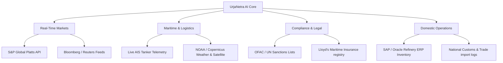

# UrjaNetra AI — Scalability & Data Integration Plan

This document outlines the architectural growth path from the current high-fidelity MVP to a production-ready, enterprise-grade national energy intelligence control system.

---

## nCurrent MVP Architecture

The platform operates on a robust, self-contained architecture designed to simulate real-world crisis responses deterministically:
- **Scenario Packs**: Built-in scenarios targeting strategic threats (e.g., Strait of Hormuz closures, OPEC production cuts).
- **Custom Crisis Feed Upload**: Dynamic ingestion of customized JSON crisis payloads containing price deltas, shipping delays, and incident lists.
- **Deterministic Python Engines**: Modular backend engines written in Python that simulate risk, macroeconomics, supply paths, compliance, and red team vectors without external dependency friction.

---

## 🔮 Future Scale & Integrations

To transition UrjaNetra AI to a live-operational command center, the platform will integrate direct API telemetry from the following sources:

### 1. Live Commodity Price Feeds
- **Integrations**: S&P Global Platts, Argus Media, and Bloomberg API.
- **Impact**: Replaces scenario pricing baseline with real-time global crude benchmarks (Brent, WTI, Urals, and regional Indian crude basket prices).

### 2. Maritime AIS Data (Tanker Tracker)
- **Integrations**: MarineTraffic API, Kpler, or Spire maritime data feeds.
- **Impact**: Provides live coordinates, speed, and ETA of all inbound crude tankers. The Risk Engine can dynamically calculate route disruption probabilities based on real-time vessel clustering near chokepoints.

### 3. Sanctions & Legal Feeds
- **Integrations**: US OFAC, EU Consolidated Financial Sanctions List, and UN Security Council databases.
- **Impact**: Automated real-time compliance screening of shipping companies, flag states, and maritime insurers.

### 4. Refinery ERP & Inventory Systems
- **Integrations**: SAP Oil & Gas, Oracle Utilities, or refinery inventory systems.
- **Impact**: Syncs live commercial stock levels, ullage capacity, and product yields across all national refineries to coordinate emergency drawdowns.

### 5. Government Import & Customs Datasets
- **Integrations**: Directorate General of Foreign Trade (DGFT) import systems and customs logs.
- **Impact**: Real-time tracking of import contracts, customs clearance rates, and buyer details.

### 6. Satellite & Weather Feeds
- **Integrations**: NOAA storm tracking, Copernicus marine environment monitoring, and piracy intelligence feeds.
- **Impact**: Predicts weather-related delays (monsoons, typhoons) and evaluates security threat vectors along the shipping lanes.
