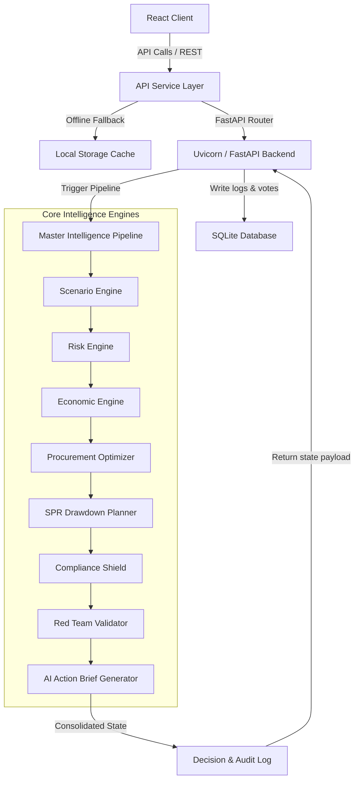

# UrjaNetra AI — System Architecture

UrjaNetra AI is a unified National Energy Resilience Command Platform designed to ingest, process, and optimize national energy security posture during strategic supply crises. This document details the end-to-end data flow and software architecture.

## Architecture Overview

UrjaNetra AI uses a decoupled **React frontend** and a **FastAPI backend** connected via a deterministic intelligence pipeline. The system enforces strict offline fallback compliance via client-side caching.

---

## Technical Details

### 1. Frontend State & Service Layer
- **Vite & React 18**: Modular components utilizing a glassmorphism theme and custom, responsive viewport grids.
- **PipelineContext (`src/context/PipelineContext.jsx`)**: The global state controller that fetches the active scenario, demo steps, and engine outputs.
- **Hardened API Service (`src/services/api.js`)**: Executes queries against the FastAPI backend (`http://127.0.0.1:8000/api`). If the backend fails or goes offline, it automatically falls back to last-known states in `localStorage` prefixed with `urjanetra_cache_` to render a clean offline dashboard state.

### 2. FastAPI Backend
- **Uvicorn Server**: High-performance ASGI server listening on port `8000`.
- **SQLAlchemy ORM**: Connects to a local SQLite database (`urjanetra.db`) storing audit logs, executive decisions, and active scenario configurations.
- **RESTful Endpoints**:
  - `/api/pipeline/state` (Fetch current master intelligence state)
  - `/api/pipeline/run` (Triggers sequential pipeline calculation)
  - `/api/scenarios/upload` (Ingests custom JSON crisis feeds)
  - `/api/demo/next` & `/api/demo/reset` (Drives the chronological demo tour)

### 3. Chronological Engine Cascade
When `/api/pipeline/run` is triggered, the **Master Intelligence Pipeline** executes the engines in a strict cascade:

1. **Scenario Engine**: Sets the active scenario configuration (baseline parameters, disruption vectors, affected suppliers, and shipping delays).
2. **Risk Engine**: Evaluates geographic route hazards, insurance premiums, and calculates a consolidated **National Risk Score**.
3. **Economic Engine**: Simulates macroeconomic impacts (inflation increase, GDP drag, local petrol/diesel prices, fiscal deficit delta).
4. **Procurement Optimizer**: Performs risk-minimizing supplier re-allocation. Evaluates cost, shipping delay, and contract flexibility to output optimized supply routes.
5. **SPR Drawdown Planner**: Evaluates current Strategic Petroleum Reserves (MMT) and calculates drawdown suggestions to keep national days of coverage secure.
6. **Compliance Shield**: Validates tankers and insurance flags against international policy frameworks (e.g., G7 price cap compliance).
7. **Red Team Validator**: Validates route resilience against adversarial scenarios (such as physical blockades, piracy, cyberattacks).
8. **AI Action Brief Generator**: Aggregates all engine telemetry into structured intelligence briefs and creates actionable items.
9. **Decision & Audit Log**: Commits the pipeline execution timestamp, metadata, and alerts to the database.
